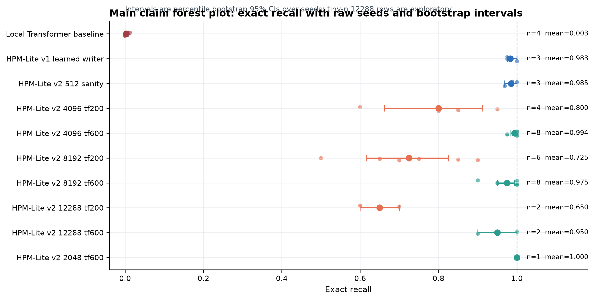
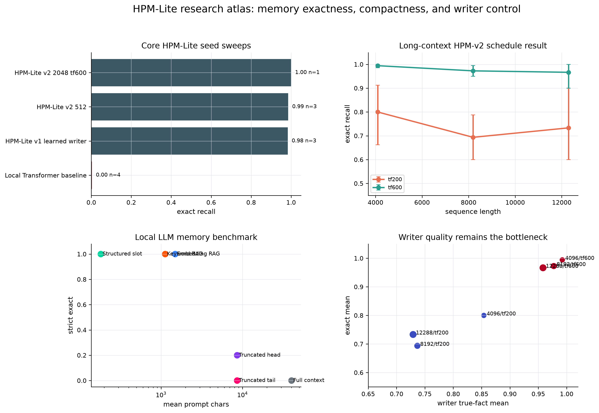
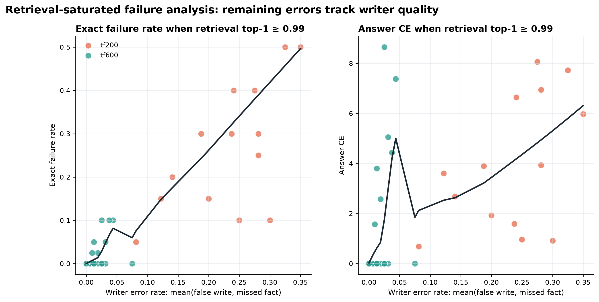
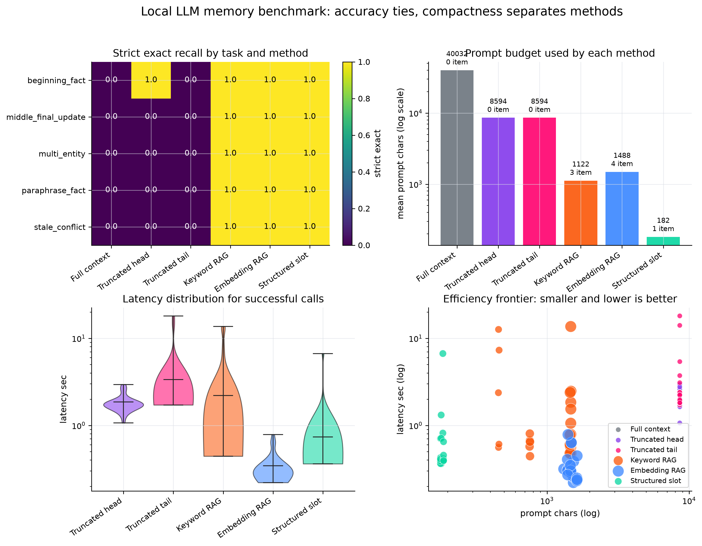

# HPM-Lite

[](https://github.com/felixpatriciorei/HPM-Lite-Memory-Model/actions/workflows/tests.yml)
[](LICENSE)
[](requirements.txt)
[](requirements.txt)
[](#scope-and-limitations)
[](https://github.com/felixpatriciorei/HPM-Lite-Memory-Model/commits/main)

Small PyTorch experiments for long-range **exact recall** with explicit neural memory.

HPM-Lite is a research testbed, not a language model. It asks whether a compact model can store key-value facts in memory and recover them thousands of tokens later, beyond a fixed local attention window.

<p align="center">
  
</p>

<details>
<summary><strong>Table of contents</strong></summary>

- [Why this exists](#why-this-exists)
- [Results at a glance](#results-at-a-glance)
- [Current result](#current-result)
- [Model sketch](#model-sketch)
- [What is measured](#what-is-measured)
- [Research-grade figures](#research-grade-figures)
- [More diagnostics](#more-diagnostics)
- [LLM memory benchmark: connecting to a real local LLM](#llm-memory-benchmark-connecting-to-a-real-local-llm)
- [Structured readout: a second diagnostic thread](#structured-readout-a-second-diagnostic-thread)
- [Statistical methodology](#statistical-methodology)
- [Quick start](#quick-start)
- [Repository layout](#repository-layout)
- [Model files](#model-files)
- [Main files](#main-files)
- [Scope and limitations](#scope-and-limitations)
- [Roadmap](#roadmap)
- [Contributing](#contributing)
- [About](#about)
- [Citation status](#citation-status)
- [License](#license)

</details>

## Why this exists

Standard attention is a strong content-addressable memory while the needed tokens remain inside the context window. The hard case is different: a fact appears early, distractor tokens fill the middle, and the query arrives after the relevant fact has fallen outside the local window.

HPM-Lite isolates that problem with a synthetic key-value recall task:

```text
FACT k12 v77
FACT k03 v19
FACT k88 v41
NOISE ...
QUERY k03
ANSWER v19
```

The answer is scored only at the final answer position. The main question is not whether the model can model language; it is whether it writes the right facts, retrieves them later, and routes retrieved memory into prediction.

## Results at a glance

The dashboard below pulls together every thread in this repo into one view: the core seed sweeps, the long-context schedule effect, the local-LLM memory benchmark, and the writer-quality bottleneck.

<p align="center">
  
</p>

- The local Transformer baseline stays at or near 0% exact recall (0.3% mean over 4 seeds at 2048 tokens) once the fact leaves its window, while every HPM-Lite variant , v1 learned writer, v2 at 512, v2 at 2048 with full schedule , clears 98% (top-left panel).
- With full writer supervision (`tf600`), v2 holds 95-99% exact recall from 4,096 to 12,288 tokens; cutting supervision to `tf200` drops it to roughly 65-80% with much wider seed variance (top-right panel).
- Against a real local LLM (Gemma 7.5B via LM Studio), structured memory ties keyword/embedding RAG at 100% strict-exact recall, while dumping the full document into context fails outright on every task (bottom-left panel) , see [LLM memory benchmark](#llm-memory-benchmark-connecting-to-a-real-local-llm) below.
- Across every long-context run, exact recall tracks writer true-fact rate almost linearly; retrieval quality is not the bottleneck (bottom-right panel) , the regression in [Statistical methodology](#statistical-methodology) below backs this up with numbers instead of just a trend line.

## Current result

### Founding result (v1): why build explicit memory at all

Before any of the v2 diagnostics below, the original HPM-Lite experiment asked a blunter question: does a fixed local-window Transformer even attempt long-range recall once the fact falls outside its window? Under oracle/null-slot writes , the model is told where to store each fact, removing the writer from the picture entirely , the answer was unambiguous:

| Sequence length | Local window | Local exact | HPM-Lite exact | Gain |
|---:|---:|---:|---:|---:|
| 512 | 256 | 0.0063 | 1.0000 | +0.9938 |
| 2048 | 256 | 0.0000 | 1.0000 | +1.0000 |
| 4096 | 256 | 0.0000 | 1.0000 | +1.0000 |
| 8192 | 256 | 0.0000 | 1.0000 | +1.0000 |

The local baseline does not partially degrade outside its window , it collapses to essentially zero. Explicit episodic memory recovers the fact every time. This is a single-seed, oracle-write result, so it is treated as motivating evidence rather than a current claim (see [Scope and limitations](#scope-and-limitations)); it is what justified building the harder, learned-writer, multi-seed v2 work below.

### Canonical Kaggle runs (v2 long-context stress matrix)

On the long-context v2 stress matrix, full-run writer supervision (`tf600`) keeps exact recall high at 4096 and 8192 tokens. Early-stop writer supervision (`tf200`) drops sharply, even when retrieval top-1 stays near 1.0.

**Working interpretation:** in these runs, retrieval is mostly saturated; the remaining long-context failure mode is writer/value quality.

These are the claim-facing Kaggle T4 runs. Intervals are percentile bootstrap 95% confidence intervals over seeds. The 12288-token rows are included as early stress evidence, not a final claim.

| Sequence length | Schedule | Seeds | Exact accuracy | 95% CI | Writer true-fact rate | Retrieval top-1 | Status |
|---:|:---|---:|---:|:---|---:|---:|:---|
| 4096 | tf600 | 8 | 0.9938 | [0.9844, 1.0000] | 0.9914 | 1.0000 | stable |
| 4096 | tf200 | 4 | 0.8000 | [0.6625, 0.9125] | 0.8539 | 1.0000 | comparison |
| 8192 | tf600 | 8 | 0.9750 | [0.9500, 0.9938] | 0.9766 | 1.0000 | stable |
| 8192 | tf200 | 6 | 0.7250 | [0.6167, 0.8250] | 0.7344 | 0.9907 | comparison |
| 12288 | tf600 | 2 | 0.9500 | [0.9000, 1.0000] | 0.9437 | 1.0000 | low-n |
| 12288 | tf200 | 2 | 0.6500 | [0.6000, 0.7000] | 0.7437 | 1.0000 | low-n |

Schedule effect, measured as `tf600 - tf200` exact accuracy:

| Sequence length | Exact gap | 95% CI | Permutation p | Cliff's delta | Status |
|---:|---:|:---|---:|---:|:---|
| 4096 | +0.1938 | [0.0781, 0.3344] | 0.0040 | 1.0000 | claim-facing |
| 8192 | +0.2500 | [0.1458, 0.3625] | 0.0013 | 0.9792 | claim-facing |
| 12288 | +0.3000 | [0.2000, 0.4000] | 0.3333 | 1.0000 | low-n |

<p align="center">
  
</p>

## Model sketch

HPM-Lite uses a small hybrid memory stack:

```text
input tokens
   │
   ├─ local path: recent exact token mixing
   ├─ recurrent path: compressed stream state
   ├─ fast-weight path: associative update/read memory
   └─ episodic path: sparse fact retrieval
        ↓
      router
        ↓
   answer distribution
```

The v1 path is a smaller learned write/retrieve memory model. The v2 path adds local mixing, selective recurrent state, fast-weight associative memory, episodic retrieval, and a four-path router. The implementation is deliberately small so that the behavior can be audited seed by seed.

<p align="center">
  
</p>

## What is measured

The project tracks memory-native diagnostics, not just final accuracy:

- answer exact accuracy
- answer cross-entropy
- retrieval top-1 / top-k
- true fact written rate
- false write rate
- missed fact rate
- written slots per sample
- retrieval margin
- parameter count
- peak VRAM
- wall time
- examples/sec
- step-level training logs

<p align="center">
  
</p>

## Research-grade figures

The current figure system is generated by one script:

```bash
python scripts/reset_research_grade_figures.py
```

It writes:

```text
results/figures/research_grade/
results/processed/research_grade/
```

The figure set includes:

| Figure | Purpose |
|---|---|
| `fig_rg_02_exact_claim_forest` | claim-facing exact recall with bootstrap intervals |
| `fig_rg_03_writer_schedule_estimation` | effect-size view of `tf600 - tf200` |
| `fig_rg_04_writer_quality_vs_exact` | relationship between writer quality and answer accuracy |
| `fig_rg_05_retrieval_saturated_failure` | failures when retrieval is already near-perfect |
| `fig_rg_06_training_dynamics_lowess` | raw step logs with LOWESS smoothing |
| `fig_rg_07_seed_distribution_ecdf` | distribution view without binning |
| `fig_rg_08_cost_performance_pareto` | accuracy versus VRAM and wall time |
| `fig_rg_09_metric_heatmap` | compact metric summary |
| `fig_rg_10_exploratory_pairgrid` | exploratory pairwise diagnostics |

An interactive Plotly dashboard is also generated:

```text
results/figures/research_grade/interactive/hpm_v2_long_context_parallel_coordinates.html
```

<p align="center">
  
</p>

## More diagnostics

<details>
<summary>Cost/accuracy Pareto, metric heatmap, and the full advanced atlas (click to expand)</summary>

<br>

Exact recall against peak VRAM and training wall time, split by schedule and hardware:

<p align="center">
  
</p>

Exact, writer, and retrieval rates across sequence length and schedule in one view:

<p align="center">
  
</p>

A larger exploratory graph/statistics atlas is generated separately:

```bash
python scripts/make_advanced_research_atlas.py
```

Outputs land in `results/figures/advanced_atlas/`, with the write-up in [`docs/figures/advanced_research_atlas.md`](docs/figures/advanced_research_atlas.md). Two figures from that atlas are embedded elsewhere in this README ([Results at a glance](#results-at-a-glance) and [LLM memory benchmark](#llm-memory-benchmark-connecting-to-a-real-local-llm)); the rest of the set:

| Figure | Purpose |
|---|---|
| `fig_adv_02_llm_compaction_frontier` | how much smaller the structured-slot prompt is than each RAG method, per task |
| `fig_adv_03_long_context_heatmap` | mixed-hardware (Kaggle + PC) heatmap view of the schedule effect |
| `fig_adv_04_schedule_effects` | tf600 vs tf200 effect sizes across lengths, all-worker data |
| `fig_adv_05_training_dynamics_envelopes` | step-level training curves with variance envelopes |
| `fig_adv_06_writer_phase_plane` | writer true-fact rate vs exact recall with a LOWESS trend, marker size = context length |
| `fig_adv_07_cost_accuracy_dual_axis` | dual-axis accuracy vs VRAM/wall-time view |
| `fig_adv_08_3d_context_schedule_surface` | 3D surface over sequence length × writer TF steps × exact recall |

Two more interactive dashboards live under `results/figures/advanced_atlas/interactive/`: `llm_memory_prompt_latency_frontier.html` and `long_context_parallel_coordinates_advanced.html`.

</details>

## LLM memory benchmark: connecting to a real local LLM

The long-context work above is entirely synthetic and self-contained. This is the first bridge to a real model: a benchmark harness that swaps in a local LLM (**Gemma 7.5B GGUF**, served through **LM Studio**'s OpenAI-compatible API) and compares six ways of getting a fact in front of it, over 5 synthetic-document tasks × 5 seeds (`scripts/run_llm_memory_benchmark.py`).

`structured_slot_memory` here is a symbolic, hand-coded slot parser , a clean control standing in for the learned HPM-Lite writer, which has not been wired into this harness yet (see [Roadmap](#roadmap)).

| Method | Strict exact | 95% CI | Mean prompt chars | Items retrieved | Mean latency (s) |
|:---|---:|:---|---:|---:|---:|
| `full_context` | 0.00 | [0, 0] | 40,032 | 0 | context-limit error, all 25 runs |
| `truncated_head` | 0.20 | [0.04, 0.36] | 8,594 | 0 | 1.87 |
| `truncated_tail` | 0.00 | [0, 0] | 8,594 | 0 | 3.37 |
| `keyword_rag` | 1.00 | [1, 1] | 1,122 | 3 | 2.20 |
| `embedding_rag` | 1.00 | [1, 1] | 1,488 | 4 | 0.34 |
| `structured_slot_memory` | 1.00 | [1, 1] | 182 | 1 | 0.74 |

<p align="center">
  
</p>

Three things stand out:

- Stuffing the whole document into context does not just lose to retrieval , it fails outright. Every `full_context` run hit the model's context limit (a ~40k-character prompt against a 7,168-token window) before it could even answer.
- The three retrieval-style methods all reach 100% strict-exact recall, so accuracy alone doesn't separate them. Prompt budget does: structured slot memory answers using **~220× fewer prompt characters than full-context** and **roughly 6-8× fewer than keyword or embedding RAG**, while retrieving a single memory item instead of 3-4 chunks.
- An earlier, smaller 3-task harness (`scripts/run_llm_memory_eval.py`, `results/processed/llm_memory_eval_rows.csv`) shows the same qualitative pattern , `full_context` 0%, `truncated_tail` 33%, `keyword_rag` and `hpm_symbolic_memory` both 100% , which is mild corroborating evidence rather than a second independent benchmark, since both harnesses share a backend and task design.

This is an evaluation harness result, not a finished HPM claim: one backend, one quantized model, no controlled ablation yet. Full method/task definitions are in [`docs/llm_memory/llm_memory_benchmark.md`](docs/llm_memory/llm_memory_benchmark.md), and the integration plan for replacing the symbolic slot parser with the learned HPM-Lite writer is in [`docs/llm_memory/roadmap_hpm_v2_and_llm_adapter.md`](docs/llm_memory/roadmap_hpm_v2_and_llm_adapter.md).

## Structured readout: a second diagnostic thread

The long-context work above asks *can the model store and find the fact again*. A parallel, more granular thread asks a different question: when a memory task fails, is it because the fact was never stored or retrieved correctly, or because the decoder fails to read out a typed value it already has in memory? This thread lives in `hpm_lite/structured_readout.py`, `hpm_lite/noisy_extraction.py`, and `scripts/run_structured_readers.py` / `scripts/run_noisy_slot_extraction.py`, documented step by step in [`docs/research/structured_memory_readout.md`](docs/research/structured_memory_readout.md).

Each stage below isolates one failure mode before changing architecture:

| Stage | What it isolates | Exact accuracy |
|:---|:---|---:|
| Typed reader, oracle slots | read/use bottleneck, independent of storage | 1.000 |
| Writer v1, canonical slot order | naive learned extraction, slot count known | 0.639 |
| Writer v2, order-invariant (DETR-style) | unordered slot-set prediction | 0.715 |
| Writer v2 decomposition: normal → oracle fields | slot existence vs field values | 0.398 → 0.724 |
| Writer v4, contextual tuple assembly, oracle candidates | relation-aware assembly, incl. hard negatives | 1.000 |
| Same pipeline, fully learned candidates | does the fix survive end-to-end? | 0.313 |

The bottleneck moved with each stage: from naive marker parsing, to slot-set prediction, to tuple assembly , which contextual relation features fixed completely (1.000, even under hard negatives) once candidate fields were given as oracle input. The open problem is the last row: swapping in the learned `CandidateFieldProposer` end to end drops exact accuracy back to 0.313, with candidate recall identified as the next thing to fix. Consistent with the rest of this repo, that regression is reported rather than hidden.

## Statistical methodology

<details>
<summary>Bootstrap CIs, permutation tests, effect sizes, and a regression check (click to expand)</summary>

<br>

`scripts/make_research_grade_figures.py` answers five questions: does explicit memory solve exact long-range recall at all, does it hold up as length increases, does the writer-supervision schedule explain long-context failure, is failure caused by retrieval collapse or writer/value quality, and what is the cost/performance frontier. The methods behind the figures and tables above:

- **Bootstrap confidence intervals** , percentile bootstrap, 95%, over seed-level run metrics. `n >= 4` is treated as usable but still seed-limited; `n < 4` is exploratory only, which is why every 12288-token row above is flagged low-n.
- **Permutation tests** , two-sided permutation p-value for the `tf600` vs `tf200` difference in mean exact recall, used as a randomization-based check alongside the bootstrap interval, not instead of it.
- **Effect sizes** , the mean gap, its bootstrap CI, Cliff's delta as a non-parametric dominance measure, and paired-seed deltas where the same seed exists in both schedules.
- **LOWESS smoothing** , diagnostic only, for step-level training dynamics; raw step points always stay visible alongside the curve.
- **ECDFs over histograms** , preferred for small seed-level result sets because every observation is represented directly instead of binned away.

**Regression check.** An exploratory OLS regression of exact recall on writer true-fact rate, retrieval top-1, log2(sequence length), and a `tf600` schedule indicator (HC3 robust standard errors, n=38 aggregate runs, R²=0.79) finds writer true-fact rate as the only statistically significant predictor: coefficient 1.34, 95% CI [0.61, 2.07], p<0.001. Retrieval top-1 is not significant in this model: coefficient 1.68, 95% CI [-1.73, 5.09], p=0.33. That's a quantitative version of the same conclusion the figures above reach visually , this is an aggregate-run regression over processed CSVs, not a per-example causal model, per `results/processed/research_grade/hpm_v2_research_grade_failure_model.csv`.

Full method notes, including the SciPy/statsmodels/seaborn/Plotly references used to choose these methods, are in [`docs/research/research_grade_statistics_methods.md`](docs/research/research_grade_statistics_methods.md).

</details>

## Quick start

```bash
git clone https://github.com/felixpatriciorei/HPM-Lite-Memory-Model.git
cd HPM-Lite-Memory-Model
python -m pip install -r requirements.txt
python -m pytest -q
```

Regenerate the current result tables and figures:

```bash
python scripts/reset_research_grade_figures.py
```

Run a small v2 smoke/stress run:

```bash
python -u scripts/run_memory_model.py \
  --models hpm_lite_v2 \
  --seq-len 512 \
  --window 256 \
  --d-model 128 \
  --layers 1 \
  --heads 4 \
  --steps 600 \
  --batch-size 16 \
  --device cuda \
  --memory-null-slot \
  --write-mode learned \
  --learned-writer-teacher-forcing-steps 200 \
  --lambda-writer 0.3 \
  --log-every 50 \
  --save-step-log \
  --record-vram \
  --save-checkpoint false \
  --summary-csv results/raw/hpm_v2_512_seed0.csv \
  --seed 0
```

## Repository layout

```text
hpm_lite/                         model, memory, training, and evaluation code
scripts/run_memory_model.py        main experiment runner
scripts/reset_research_grade_figures.py
scripts/make_research_grade_figures.py
                                  current statistics and figure pipeline
results/raw/                       imported seed-level run summaries
results/processed/research_grade/  canonical processed tables
results/figures/research_grade/    current figure set
docs/research_grade_statistics_methods.md
docs/research_grade_results.md
tests/                             unit and integration tests
```

## Model files

The repository keeps the original compact HPM-Lite implementation and the newer v2 implementation side by side:

- `hpm_lite/model.py` contains the original HPM-Lite model used for the first learned-writer KV-recall experiments.
- `hpm_lite/hpm_v2.py` contains the v2 memory components: selective recurrence, fast-weight memory, episodic retrieval, and routing utilities.
- `hpm_lite/hpm_v2_model.py` wraps the v2 components into a trainable/evaluable model interface.
- `hpm_lite/structured_readout.py` and `hpm_lite/noisy_extraction.py` contain the typed reader/writer pipeline used in the [structured readout thread](#structured-readout-a-second-diagnostic-thread).
- `hpm_lite/llm_memory_adapter.py` contains the adapter scaffolding for the [LLM memory benchmark](#llm-memory-benchmark-connecting-to-a-real-local-llm).

For figure generation, use the canonical entry point:

```bash
python scripts/make_figures.py
```

Older `make_*_figures.py` entry points have been archived under `scripts/legacy_figures/` to keep the top-level scripts directory focused.

Advanced graph/statistics atlas:

```bash
python scripts/make_advanced_research_atlas.py
```

Outputs:

```text
results/figures/advanced_atlas/
results/processed/advanced_atlas/
docs/figures/advanced_research_atlas.md
```

## Main files

```text
hpm_lite/hpm_v2.py
hpm_lite/hpm_v2_model.py
hpm_lite/train.py
hpm_lite/evaluate.py
hpm_lite/memory.py
scripts/run_memory_model.py
scripts/make_research_grade_figures.py
results/processed/research_grade/hpm_v2_research_grade_run_matrix.csv
results/processed/research_grade/hpm_v2_research_grade_inference_summary.csv
results/processed/research_grade/hpm_v2_research_grade_schedule_effects.csv
```

## Scope and limitations

HPM-Lite is a controlled memory experiment. It does not claim to be a general LLM, to beat modern long-context models, or to prove that synthetic key-value recall transfers directly to real language tasks.

Current limitations:

- 12288-token evidence is promising but under-sampled.
- The project still needs local-baseline stress runs at 4096/8192/12288.
- v2 path ablations are planned but not complete.
- Mixed Kaggle/PC runs are useful sensitivity checks, not the primary claim set.
- Per-example failure logs would make the writer/retrieval diagnosis stronger.
- The local LLM memory benchmark uses a single backend (Gemma 7.5B, quantized, via LM Studio) and a symbolic structured-slot control, not yet the learned HPM-Lite writer.
- The structured-readout thread is still synthetic typed-slot data; end-to-end exact accuracy with fully learned candidate extraction is currently low (0.313) and is the open problem in that thread.

## Roadmap

Near-term:

- add more 12288-token seeds
- run long-context local baselines
- add v2 ablations: no episodic path, no fast-weight path, no selective recurrent path, router disabled
- add per-example failure traces
- separate paper-ready figures from exploratory dashboards
- fix learned candidate-field recall in the structured-readout pipeline (currently the bottleneck, see [Structured readout](#structured-readout-a-second-diagnostic-thread))

Longer-term:

- natural-language key-value recall (early progress: structured-readout thread above)
- planted-fact document QA
- multi-hop/entity-state tracking
- memory adapter experiments for small frozen LLMs (early harness exists, see [LLM memory benchmark](#llm-memory-benchmark-connecting-to-a-real-local-llm); learned-writer integration still pending)

## Contributing

This started as a solo research/portfolio project, but issues and pull requests are welcome, particularly around the open items in [Roadmap](#roadmap) (v2 ablations, local baselines, additional seeds, learned candidate-field recall).

Before opening a PR:

```bash
python -m pip install -r requirements.txt
python -m pytest -q
```

A few project conventions worth keeping:

- Any new figure should ship with the script that generates it and the underlying CSV in `results/processed/`, not just the PNG.
- Claims in the README should stay tied to committed result files; speculative numbers belong in `docs/`, not the front page.
- Keep additions to `hpm_lite/` covered by a corresponding test in `tests/`.

For larger changes (new memory path, new task variant), opening an issue first to discuss the approach is preferred over a large unsolicited PR.

## About

HPM-Lite is maintained by [Felix Patricio](https://github.com/felixpatriciorei) as a research and portfolio project exploring explicit, auditable memory mechanisms for long-context recall. The repository follows three connected threads: whether a compact model can store and retrieve long-range facts at all, and how that holds up as context grows (the v1/v2 work above); whether failures come from storage/retrieval or from the typed read/use operator (the structured-readout thread); and whether the same explicit-memory idea is useful as an external interface for a real, frozen local LLM (the LLM memory benchmark). None of the three is presented as finished , each section above states what is claim-safe today and what is still exploratory.

The figure and reporting style draws on general open-source documentation guidance, scientific figure-design guidance aimed at objective data display, and reporting checklists that expect clearly described error bars and experimental uncertainty, rather than any single template.

## Citation status

No formal paper release yet. Cite the repository directly if you use the code or figures.

## License

This repository is released under the MIT License. See [`LICENSE`](LICENSE).
