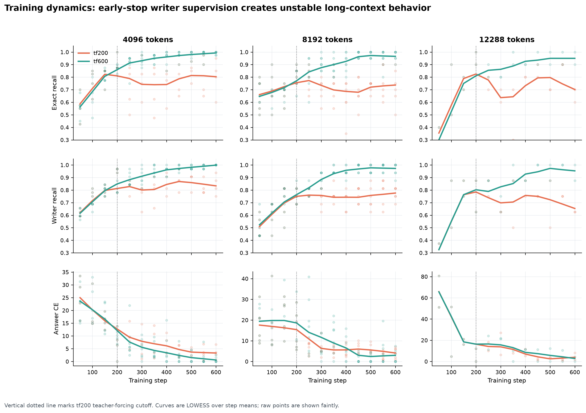
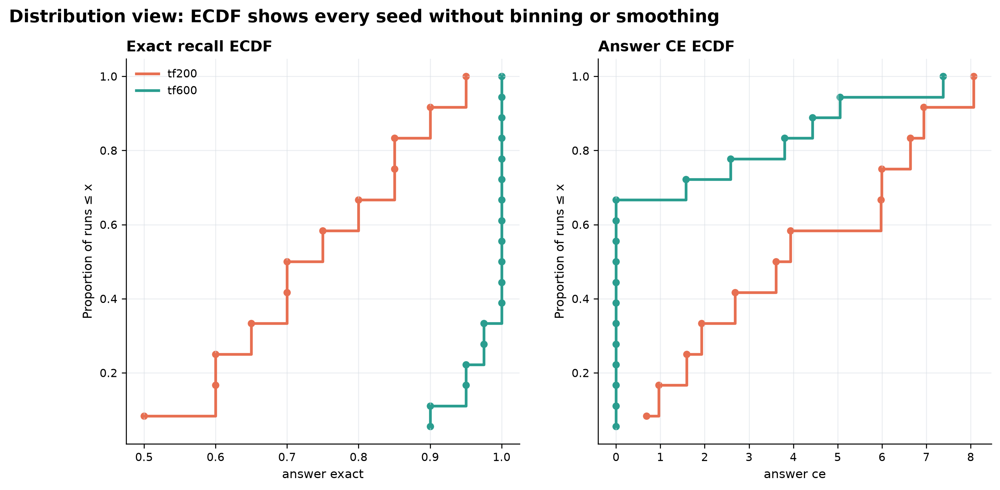

# HPM-Lite

> A small, reproducible PyTorch research project for testing explicit memory in long-range exact recall.

HPM-Lite asks one narrow question on purpose:

**Can a small model with explicit write/retrieve memory remember key-value facts thousands of tokens later, when a fixed-window local Transformer baseline cannot attend back to the original fact?**

The current answer is **yes on the synthetic key-value recall benchmark in this repo**, with the strongest current evidence coming from a research-grade long-context stress matrix at 4096, 8192, and 12288 tokens. This is not a chatbot, not a general LLM, and not a claim that HPM replaces Transformers. It is a controlled memory testbed with seed-level CSVs, diagnostics, reproducible scripts, and statistical figures.


---

## What changed in the figure reset

The old graph stack has been retired. The project now uses one canonical research-grade figure pipeline:

```bash
python scripts/reset_research_grade_figures.py
```

That reset removes the legacy `results/figures/paper`, `results/figures/advanced`, and `docs/figures` directories, then regenerates:

```text
results/figures/research_grade/
results/processed/research_grade/
```

The new figures prioritize raw seed points, bootstrap confidence intervals, effect sizes, schedule-gap estimation, ECDFs, LOWESS training dynamics, retrieval-saturated failure analysis, and cost/performance views.

---

## Current headline

HPM-Lite v2 remains strong at long context when writer supervision is kept through the full 600-step run. When writer teacher forcing stops early at step 200, exact recall drops sharply even though retrieval top-1 usually stays near perfect.

**Main interpretation:** retrieval is mostly saturated; the remaining long-context failure mode is writer/value quality.


---

## Canonical Kaggle long-context results

These are the claim-facing results from the canonical Kaggle T4 runs. Error intervals are percentile bootstrap 95% confidence intervals over seeds. The 12288-token rows are marked exploratory because `n=2` is too small for strong claims.

|   Seq len | writer schedule   |   n |   Mean exact |   95% CI low |   95% CI high |   Writer true fact |   Retrieval top-1 | Status                             |
|----------:|:------------------|----:|-------------:|-------------:|--------------:|-------------------:|------------------:|:-----------------------------------|
|      4096 | tf200             |   4 |       0.8    |       0.6625 |        0.9125 |             0.8539 |            1      | claim-safe                         |
|      4096 | tf600             |   8 |       0.9938 |       0.9844 |        1      |             0.9914 |            1      | claim-safe                         |
|      8192 | tf200             |   6 |       0.725  |       0.6167 |        0.825  |             0.7344 |            0.9907 | claim-safe                         |
|      8192 | tf600             |   8 |       0.975  |       0.95   |        0.9938 |             0.9766 |            1      | claim-safe                         |
|     12288 | tf200             |   2 |       0.65   |       0.6    |        0.7    |             0.7437 |            1      | exploratory/low-n or mixed workers |
|     12288 | tf600             |   2 |       0.95   |       0.9    |        1      |             0.9437 |            1      | exploratory/low-n or mixed workers |

### Schedule effect: tf600 − tf200

|   Seq len |   n tf600 |   n tf200 |   Exact gap |   95% CI low |   95% CI high |   Permutation p |   Cliff's delta | Status                             |
|----------:|----------:|----------:|------------:|-------------:|--------------:|----------------:|----------------:|:-----------------------------------|
|      4096 |         8 |         4 |      0.1937 |       0.0781 |        0.3344 |          0.004  |          1      | claim-safe                         |
|      8192 |         8 |         6 |      0.25   |       0.1458 |        0.3625 |          0.0013 |          0.9792 | claim-safe                         |
|     12288 |         2 |         2 |      0.3    |       0.2    |        0.4    |          0.3333 |          1      | exploratory/low-n or mixed workers |


---

## Mechanism diagnosis

The long-context stress matrix separates three different things that simple bar charts hide:

1. **Exact answer recall**: whether the final answer token is correct.
2. **Retrieval top-1**: whether the correct fact is retrieved.
3. **Writer true-fact rate**: whether the model wrote useful facts into memory.

The important pattern is that retrieval remains very high while tf200 loses exact recall and writer quality. That is why the main v2 diagnosis is writer drift, not retrieval collapse.


---

## Training dynamics

The training dynamics figure shows raw step logs plus LOWESS-smoothed trends. The vertical dotted line marks the step-200 teacher-forcing cutoff. The pattern is used as a diagnostic, not as causal proof by itself.



---

## Distribution and systems views

The ECDF figure shows every run without binning. The Pareto figure shows practical cost signals, including VRAM and wall time. Mixed-worker results are treated as sensitivity checks, not as the primary claim set.




An interactive parallel-coordinates dashboard is generated at:

```text
results/figures/research_grade/interactive/hpm_v2_long_context_parallel_coordinates.html
```

---

## Benchmark

The task is intentionally simple:

```text
FACT k12 v77
FACT k03 v19
FACT k88 v41
NOISE ...
QUERY k03
ANSWER v19
```

The model is scored only at the answer position. The important difficulty is distance: the relevant fact can be far outside the local attention window.

```text
local window = 256
stress lengths = 4096, 8192, 12288
```

A fixed-window local model cannot directly attend back to many earlier facts at answer time. HPM-Lite must write useful facts into memory, retrieve them later, and route the retrieved memory into prediction.


---

## Architecture

### HPM-Lite v1

HPM-Lite v1 combines three paths:

1. local path for nearby token mixing,
2. recurrent path for compressed stream state,
3. episodic path for sparse key-value memory retrieval.

A learned router mixes the paths before prediction:

```text
x_t -> local mixer       -> l_t
    -> recurrent state   -> r_t
    -> episodic retrieve -> e_t

alpha = softmax(W[l_t, r_t, e_t])
m_t   = alpha_l*l_t + alpha_r*r_t + alpha_e*e_t
p(y)  = softmax(W_o m_t)
```

### HPM-Lite v2

HPM-Lite v2 adds a richer experimental memory hierarchy:

1. local path,
2. selective recurrent path,
3. fast-weight associative memory path,
4. episodic sparse retrieval path,
5. 4-path router,
6. JEPA-lite auxiliary support kept separate from exact fact storage.

The v2 goal is not to instantly beat v1 everywhere. The goal is to turn the toy memory proof into a more modular memory architecture that can later attach to small LLMs as a memory adapter.

---

## Reproducibility

Install dependencies:

```bash
pip install -r requirements.txt
```

Run tests:

```bash
python -m pytest -q
```

Regenerate the full research-grade figure suite:

```bash
python scripts/reset_research_grade_figures.py
```

The reset script intentionally replaces the previous figure system. Older figure scripts now delegate to `scripts/make_research_grade_figures.py`.

---

## Important generated files

```text
scripts/make_research_grade_figures.py
scripts/reset_research_grade_figures.py
results/processed/research_grade/hpm_v2_research_grade_run_matrix.csv
results/processed/research_grade/hpm_v2_research_grade_inference_summary.csv
results/processed/research_grade/hpm_v2_research_grade_schedule_effects.csv
results/processed/research_grade/hpm_v2_research_grade_failure_model.csv
results/processed/research_grade/hpm_v2_research_grade_training_dynamics.csv
results/figures/research_grade/research_grade_figure_manifest.csv
docs/research_grade_statistics_methods.md
docs/research_grade_results.md
docs/legacy_graph_retirement_manifest.md
```

---

## What this project does not claim

This repo does **not** claim:

* HPM-Lite is a general language model.
* HPM-Lite beats modern LLMs.
* Synthetic KV recall is the same as real-world reasoning.
* The current learned writer is final.
* JEPA-lite is proven useful yet.
* 12288-token behavior is fully validated; current 12288 rows are promising but low-n.

The honest claim is narrower:

> Explicit learned write/retrieve memory can make a small model solve a long-range exact-recall task that a fixed-window local Transformer baseline fails under the tested setting; in HPM-Lite v2, long-context reliability is strongly controlled by the writer-supervision schedule.

---

## Roadmap

Near-term:

1. Add more 12288-token seeds.
2. Add local baseline stress runs at 4096/8192/12288.
3. Add real v2 ablations:
   * no episodic memory,
   * no fast-weight path,
   * no selective recurrent path,
   * router disabled,
   * oracle writer vs learned writer.
4. Add per-example prediction logs so failure analysis can move beyond aggregate-run statistics.
5. Build an HPM-to-small-LLM memory adapter benchmark:
   * LLM alone,
   * LLM + naive retrieval,
   * LLM + HPM retrieval.

Longer-term:

* natural-language KV recall,
* multi-hop recall,
* entity-state tracking,
* long-document planted-fact QA,
* soft-prompt memory adapter for a frozen 1B–3B open LLM.

---

## Research integrity notes

The project separates results into:

* **canonical Kaggle rows** for the main long-context claim,
* **all-worker sensitivity rows** for mixed Kaggle/PC checks,
* **low-n exploratory rows** for promising but under-sampled settings,
* **diagnostic plots** for mechanism discovery, not overclaiming.

The goal is not to make the numbers look bigger. The goal is to make the evidence easier to audit.
