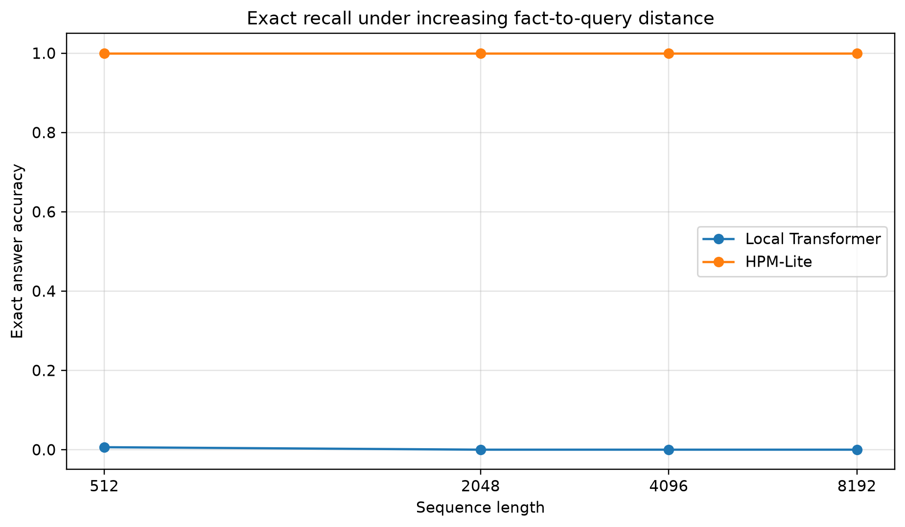
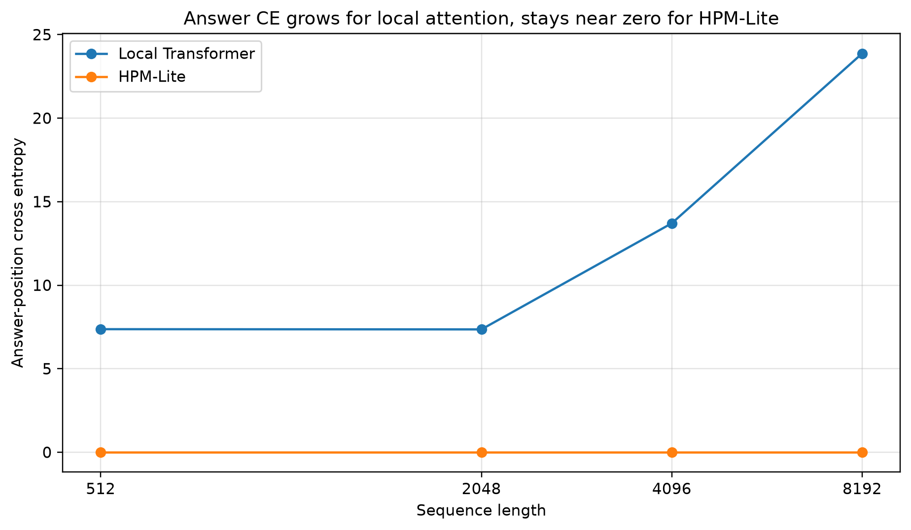
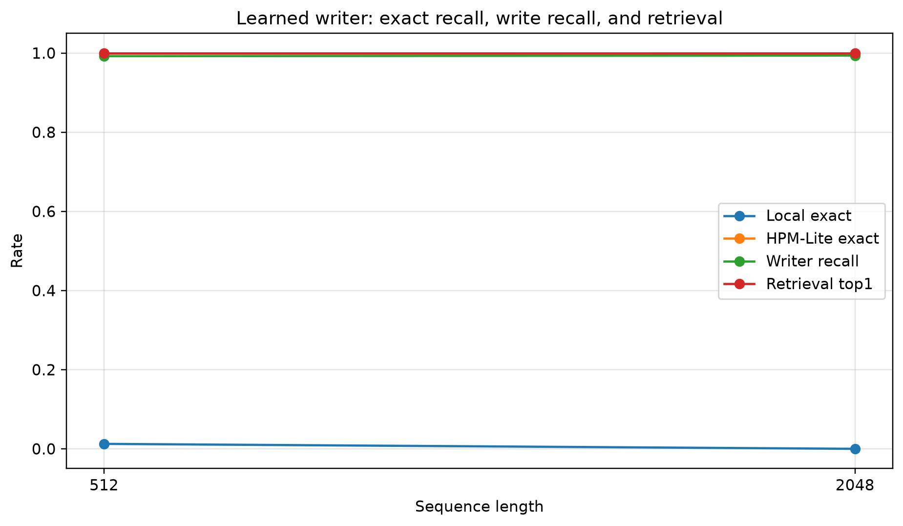
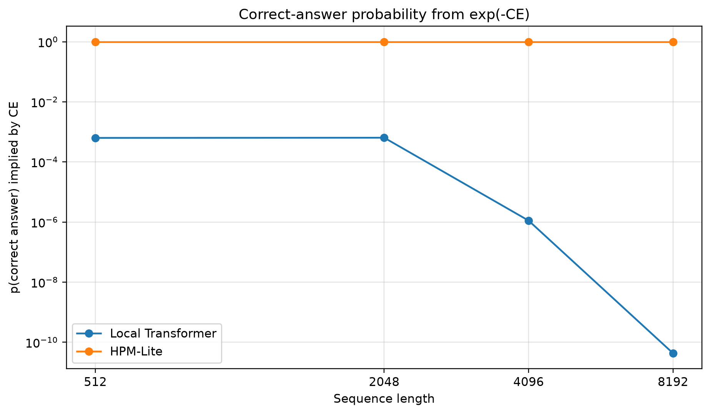
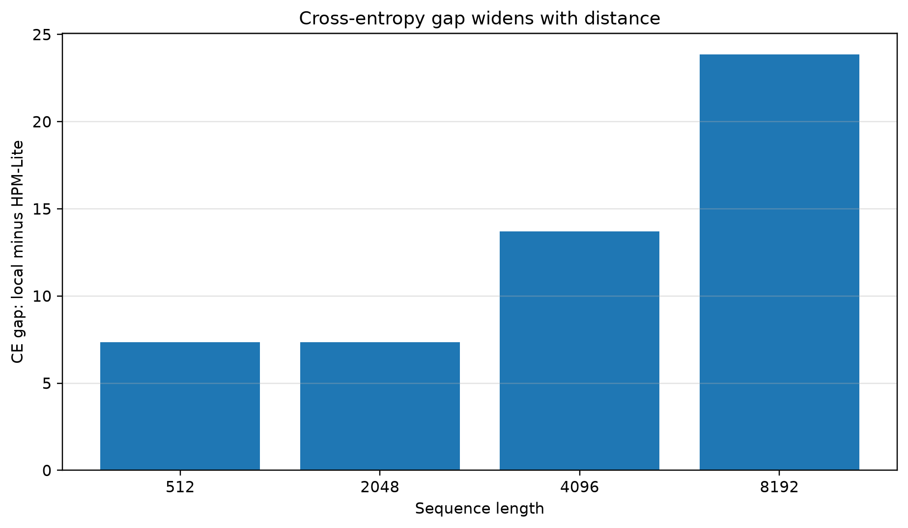
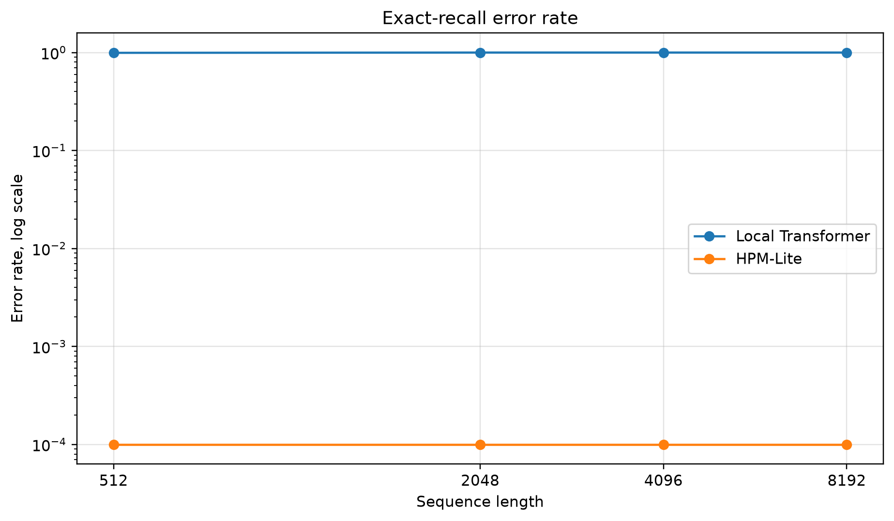
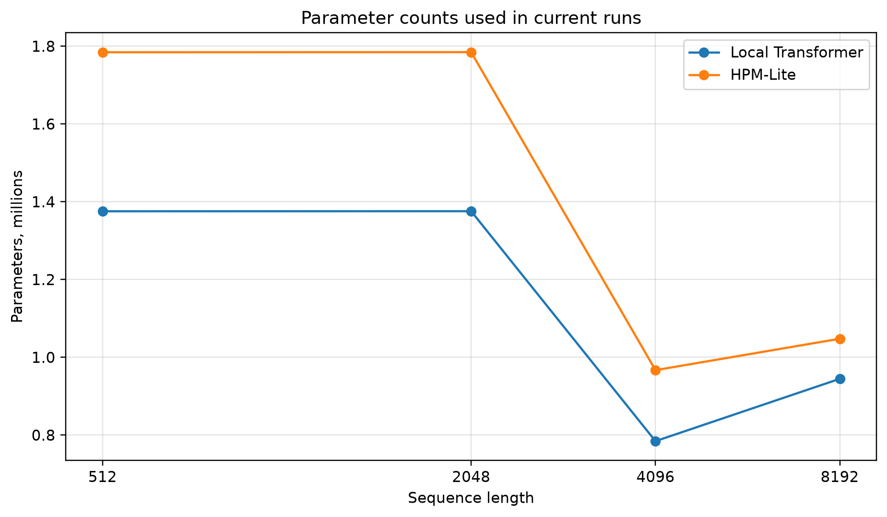
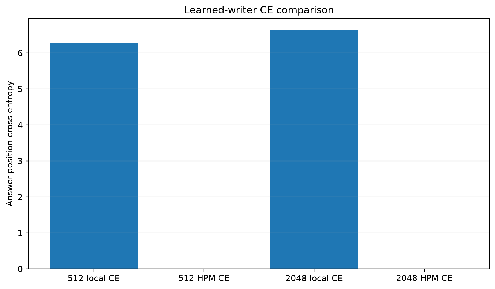

# HPM-Lite Memory Model

> **Can a small HPM-style model remember long-range key-value facts better than a local Transformer under similar compute?**

HPM-Lite Memory Model is a compact PyTorch research prototype for one narrow claim: explicit memory can preserve exact long-range facts that a fixed-window local Transformer cannot see.

This is **not** a chatbot, not a production LLM, and not a claim that HPM replaces Transformers. It is a controlled memory experiment with reproducible code, commands, tables, figures, and caveats.

## Result snapshot



| Setting | Seq len | Window | Local exact | HPM-Lite exact | Gain | Local CE | HPM CE |
|---|---:|---:|---:|---:|---:|---:|---:|
| Oracle write | 512 | 256 | 0.0063 | 1.0000 | +0.9938 | 7.37 | 0.00 |
| Oracle write | 2048 | 256 | 0.0000 | 1.0000 | +1.0000 | 7.35 | 0.00 |
| Null-slot memory | 4096 | 256 | 0.0000 | 1.0000 | +1.0000 | 13.71 | 0.00 |
| Null-slot memory | 8192 | 256 | 0.0000 | 1.0000 | +1.0000 | 23.87 | 0.00 |
| Learned writer | 512 | 256 | 0.0125 | 1.0000 | +0.9875 | 6.27 | 0.00 |
| Learned writer | 2048 | 256 | 0.0000 | 1.0000 | +1.0000 | 6.63 | ~0.00 |

The 2048-token learned-writer run reached `eval_answer_exact = 1.0`, `retrieval_top1 = 1.0`, and `true_fact_written_rate = 0.99375`.

## What “local” means

The local baseline is a tiny Transformer with a fixed local attention window. If the needed fact is farther back than the window, the model cannot directly inspect it.

```text
FACT k44 v12
... thousands of distractor tokens ...
QUERY k44
ANSWER v12
```

HPM-Lite writes facts into episodic memory and retrieves them later by key.

## What answer-position CE means

Answer-position cross entropy is:

```text
CE = -log(p(correct answer))
```

Lower is better. CE near zero means the model put almost all probability on the correct answer. CE around 7, 14, or 24 means the model assigned tiny probability to the correct answer.



## Model paths

```text
x_t -> embedding

l_t = local mixer
r_t = GRU recurrent state
e_t = episodic memory retrieval

alpha = softmax(W[l_t, r_t, e_t])
m_t = alpha_l l_t + alpha_r r_t + alpha_e e_t
p(y) = softmax(W_o m_t)
```

Current components:

- local path for recent token mixing
- recurrent path for compressed continuity
- episodic path for exact key-value memory
- router for path mixing
- null slot so memory can choose “retrieve nothing”
- supervised learned writer as the first step away from oracle writes

## Learned-writer result



The learned writer is no longer pure oracle memory. It receives synthetic supervision during training, then writes selected slots at evaluation. Current results:

| Seq len | Local exact | HPM exact | Writer recall | Retrieval top1 |
|---:|---:|---:|---:|---:|
| 512 | 0.0125 | 1.0000 | 0.9922 | 1.0000 |
| 2048 | 0.0000 | 1.0000 | 0.9938 | 1.0000 |

## Figures











## Install

```bash
git clone https://github.com/felixpatriciorei/HPM-Lite-Memory-Model.git
cd HPM-Lite-Memory-Model
pip install -r requirements.txt
```

Verify CUDA:

```bash
python -c "import torch; print(torch.__version__); print(torch.cuda.is_available()); print(torch.cuda.get_device_name(0) if torch.cuda.is_available() else 'no cuda')"
```

## Tests

```bash
pytest -q
```

Targeted:

```bash
pytest -q tests/test_memory.py tests/test_hpm_lite_router.py tests/test_shapes.py tests/test_learned_writer.py
```

## Run experiments

Oracle/null-slot run:

```bash
python scripts/run_memory_model.py --seq-len 2048 --window 256 --d-model 192 --layers 2 --heads 4 --steps 200 --batch-size 32 --device cuda --memory-null-slot
```

Learned-writer run:

```bash
python scripts/run_memory_model.py --seq-len 2048 --window 256 --d-model 128 --layers 1 --heads 4 --steps 600 --batch-size 8 --device cuda --memory-null-slot --write-mode learned --learned-writer-teacher-forcing-steps 200 --lambda-writer 0.3
```

Long 8GB GPU run:

```bash
python scripts/run_memory_model.py --seq-len 8192 --window 256 --d-model 96 --layers 1 --heads 4 --steps 80 --batch-size 2 --device cuda --memory-null-slot
```

## Generate figures

```bash
python scripts/make_scientific_figures.py
```

## Current limitations

Already shown:

- HPM-Lite solves synthetic long-range key-value recall with oracle/null-slot memory.
- The local-window baseline collapses outside its local window.
- The supervised learned writer solves the 512-token and 2048-token tasks with high writer recall.

Not yet proven:

- multi-seed robustness
- parameter-matched results across all distances
- fully autonomous writing without synthetic labels
- natural-language extraction
- chatbot behavior
- general replacement of full attention

## Next evidence

1. Add `--models` and `--log-every`.
2. Add ablations: no episodic, no recurrent, no router, no null slot.
3. Add shuffled-memory and missing-key controls.
4. Add VRAM/tokens/sec logging.
5. Run multi-seed sweeps.
