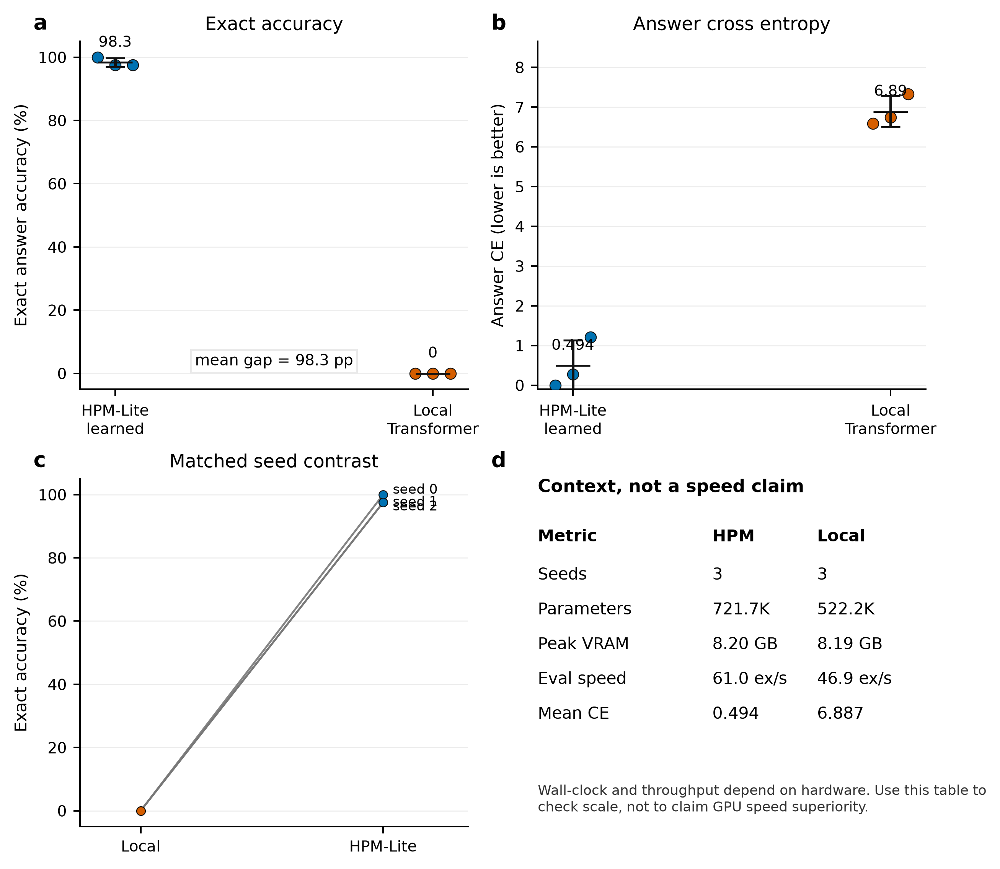
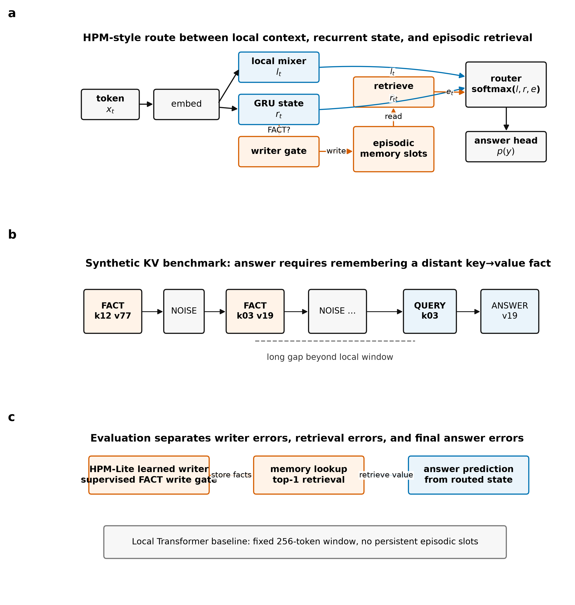
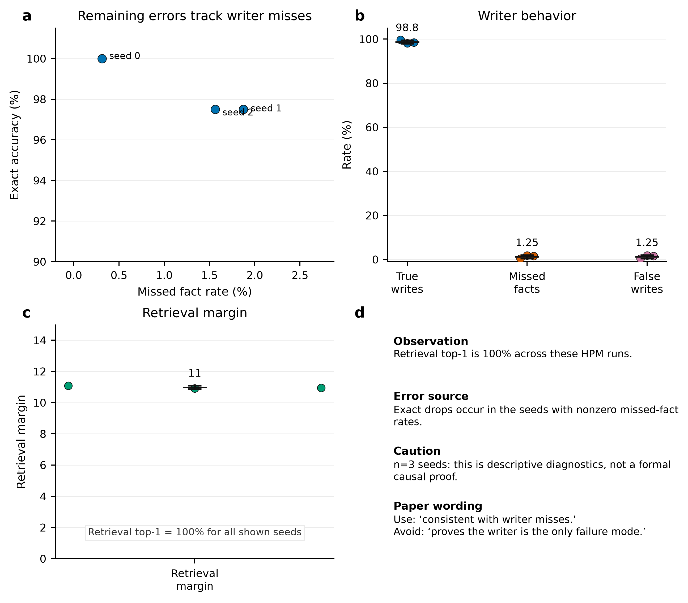
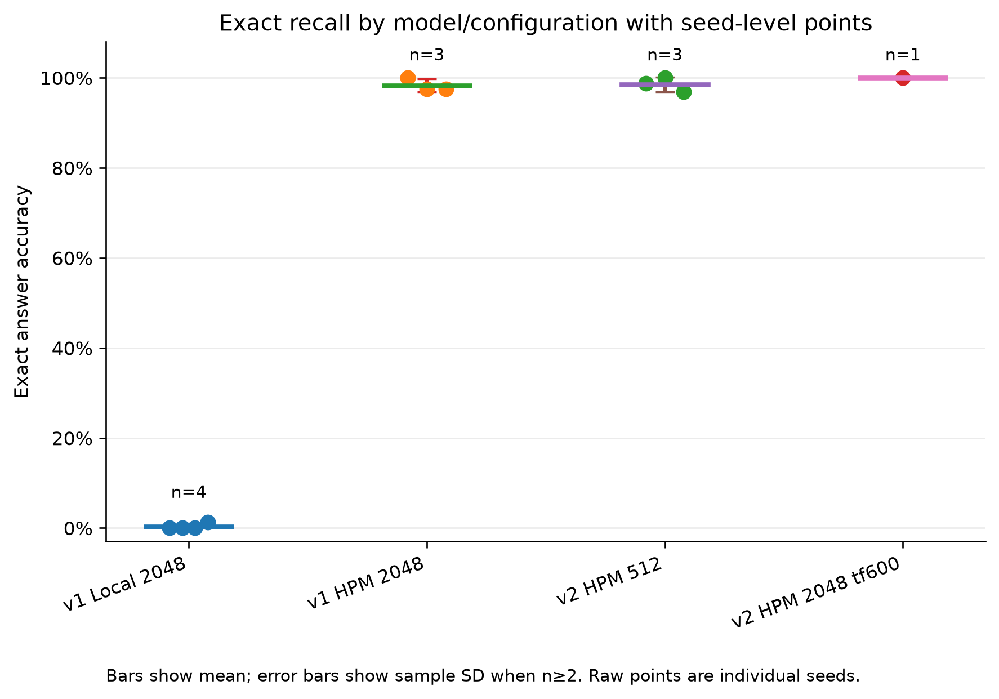
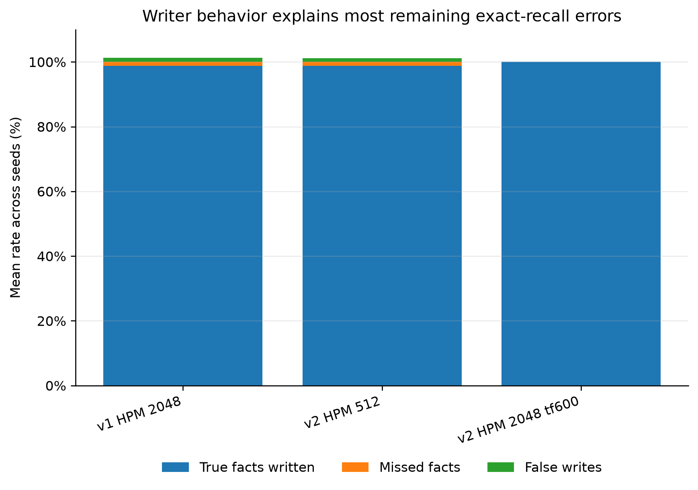
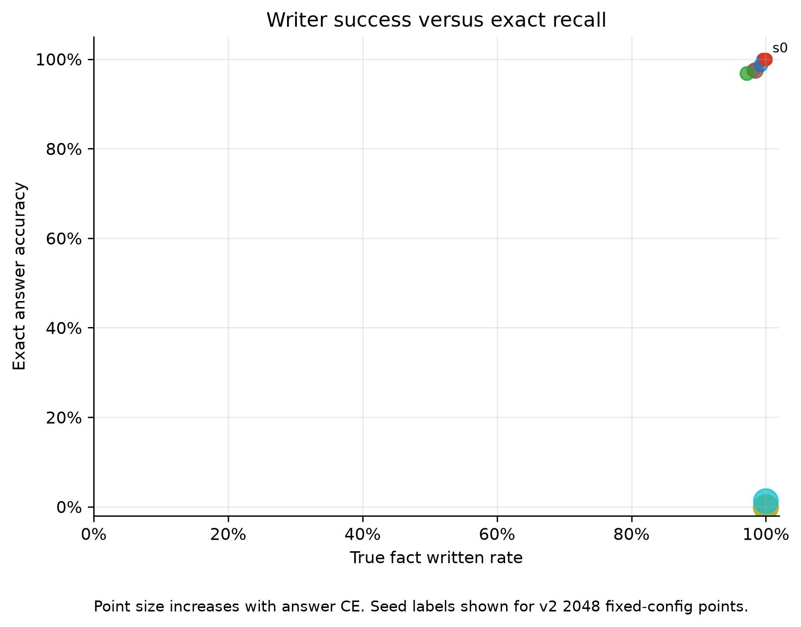
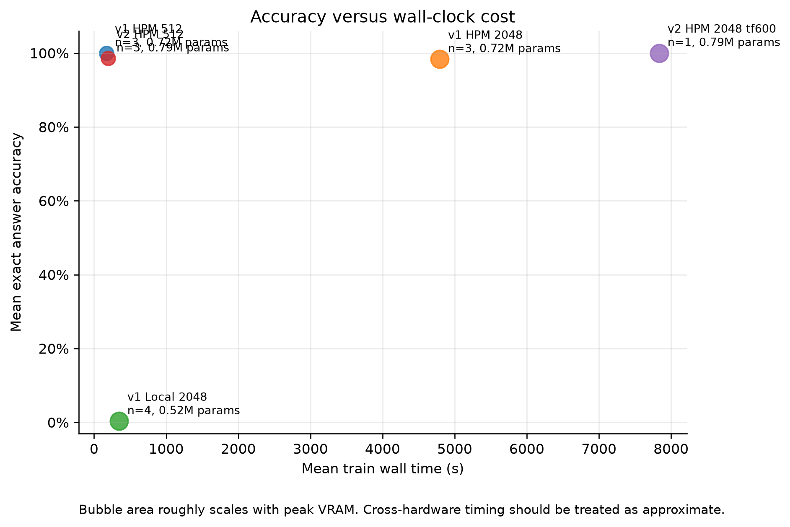
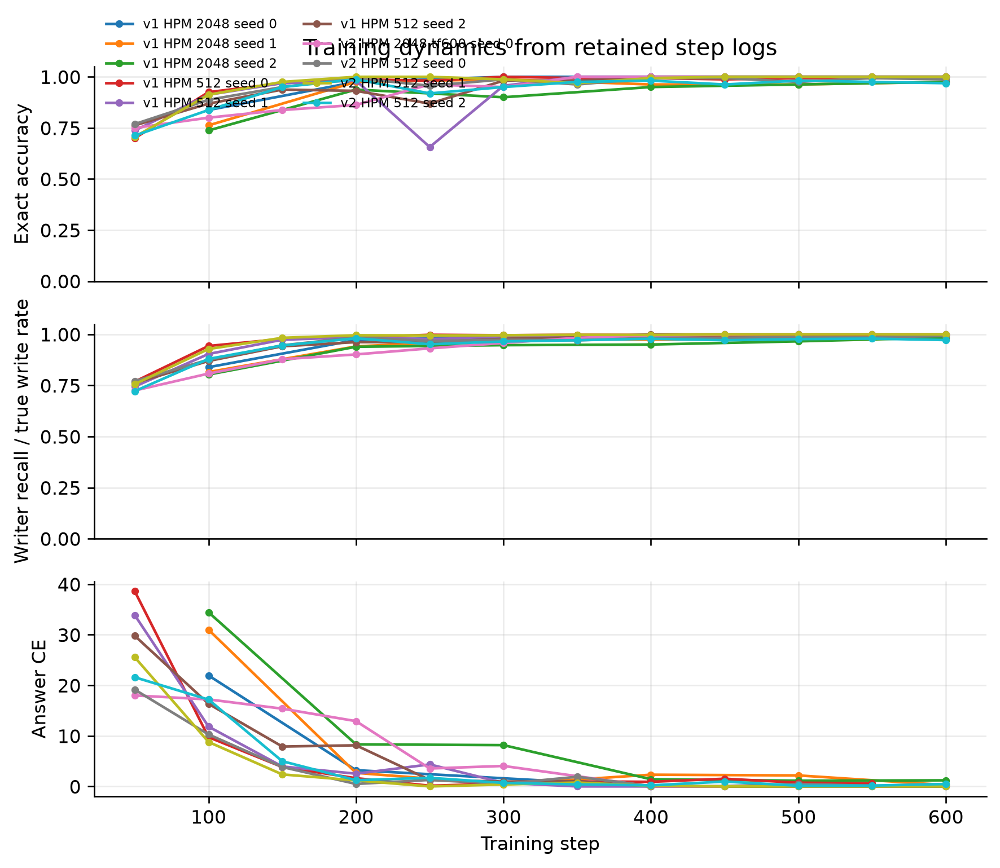

# HPM-Lite

> A small, reproducible PyTorch research project for testing explicit memory in long-range exact recall.

HPM-Lite asks a narrow question on purpose:

**Can a small model with explicit write/retrieve memory remember key-value facts thousands of tokens later, when a fixed-window Transformer baseline cannot attend back to the original fact?**

The current answer is **yes on the synthetic key-value recall benchmark in this repo**. This is not a chatbot, a general LLM, or a claim that HPM replaces Transformers. It is a controlled memory testbed with reproducible scripts, seed-level CSVs, diagnostics, and figure generation.



---

## Current status

| Track                                      |                                                                                  Status | Evidence                                                                |
| ------------------------------------------ | --------------------------------------------------------------------------------------: | ----------------------------------------------------------------------- |
| HPM-Lite v1 learned writer                 |                                                                Stable 2048-token result | `results/processed/learned_writer_2048_seed_sweep.csv`                  |
| Local Transformer baseline                 |                                Collapses at 2048 under the same local-window constraint | `results/processed/local_2048_seed_sweep.csv`                           |
| HPM-Lite v2 core modules                   |                                                                  Implemented and tested | `hpm_lite/hpm_v2.py`, `tests/test_hpm_v2_modules.py`                    |
| HPM-Lite v2 training path                  |                                                                              Integrated | `hpm_lite/hpm_v2_model.py`, `tests/test_hpm_v2_training_integration.py` |
| HPM-Lite v2 512-token sweep                |                                                                        3 seeds complete | `results/processed/hpm_v2_512_seed_sweep.csv`                           |
| HPM-Lite v2 2048-token fixed-writer recipe | seed 0 tracked; additional Kaggle runs observed but not yet imported into processed CSV | `results/processed/hpm_v2_2048_tf600_lw03_seed_sweep.csv`               |

---

## Headline results

### 2048-token HPM-Lite v1 vs local Transformer

At sequence length 2048 with a 256-token local window, HPM-Lite v1 with a learned writer reaches **98.33% mean exact accuracy over 3 seeds**, while the matched local Transformer baseline reaches **0.00% over the matched 3 seeds**.

| Model                       | Seq len | Window |     Seeds |  Params |  Exact accuracy |       Answer CE |
| --------------------------- | ------: | -----: | --------: | ------: | --------------: | --------------: |
| HPM-Lite v1, learned writer |    2048 |    256 |         3 | 721,671 | 0.9833 ± 0.0144 | 0.4943 ± 0.6340 |
| Local Transformer baseline  |    2048 |    256 | 3 matched | 522,242 | 0.0000 ± 0.0000 | 6.8873 ± 0.3920 |
| Local Transformer baseline  |    2048 |    256 |   4 total | 522,242 | 0.0031 ± 0.0063 | 6.9785 ± 0.3684 |

Error bars are sample standard deviation across seeds, not confidence intervals.

### HPM-Lite v2 early result

HPM-Lite v2 adds a more explicit hybrid memory stack: local mixing, selective recurrent state, fast-weight associative memory, episodic retrieval, and a 4-path router.

| Model/config                | Seq len | Window |            Seeds |  Exact accuracy | Notes                                                               |
| --------------------------- | ------: | -----: | ---------------: | --------------: | ------------------------------------------------------------------- |
| HPM-Lite v2, learned writer |     512 |    256 |                3 | 0.9854 ± 0.0157 | stable 512-token sanity sweep                                       |
| HPM-Lite v2, tf600/lw0.3    |    2048 |    256 |        1 tracked |          1.0000 | fixed writer recipe; needs more tracked seeds before headline claim |
| HPM-Lite v2, tf200/lw0.3    |    2048 |    256 | development runs |   0.8625–0.9000 | writer drift after teacher forcing ends too early                   |

The v2 2048 result is deliberately presented conservatively. The key development finding is that **retrieval stayed strong, while writer recall drifted when teacher forcing ended at step 200**. Keeping writer supervision through the full 600-step run fixed tracked seed 0 to 100% exact accuracy.

---

## The benchmark

The task is intentionally simple:

```text
FACT k12 v77
FACT k03 v19
FACT k88 v41
NOISE ...
QUERY k03
ANSWER v19
```

The model is scored only at the answer position. The important difficulty is distance: the relevant fact can be far outside the local attention window.

Main long-context setting:

```text
sequence length = 2048
local window    = 256
```

A local Transformer cannot directly attend back to many earlier facts at answer time. HPM-Lite must learn to write useful facts into memory, retrieve them later, and route the retrieved memory into prediction.

---

## Architecture

### HPM-Lite v1

HPM-Lite v1 combines three paths:

1. **Local path** for nearby token mixing.
2. **Recurrent path** for compressed stream state.
3. **Episodic path** for sparse key-value memory retrieval.

A learned router mixes the paths before prediction:

```text
x_t -> local mixer       -> l_t
    -> recurrent state   -> r_t
    -> episodic retrieve -> e_t

alpha = softmax(W[l_t, r_t, e_t])
m_t   = alpha_l*l_t + alpha_r*r_t + alpha_e*e_t
p(y)  = softmax(W_o m_t)
```



### HPM-Lite v2

HPM-Lite v2 is the experimental path for a richer memory hierarchy:

1. **Local path**: short-range mixing.
2. **Selective recurrent path**: input-conditioned stream memory.
3. **Fast-weight memory path**: associative matrix-style memory updates.
4. **Episodic path**: sparse exact key-value retrieval.
5. **Router**: learns how much each path contributes.
6. **JEPA-lite auxiliary module**: latent future-block prediction support, kept separate from exact fact storage.

The v2 goal is not to instantly beat v1 everywhere. The goal is to turn the toy memory proof into a more modular memory architecture that can later attach to small LLMs as a memory adapter.

---

## Diagnostics, not just scores

The project tracks more than exact accuracy:

* answer exact accuracy
* answer cross-entropy
* retrieval top-1 / top-k
* true fact written rate
* missed fact rate
* false write rate
* written slots per sample
* retrieval margin
* parameters
* VRAM
* wall time
* examples/sec
* step-level training logs



The main v1 diagnostic story: once useful facts are written, retrieval is reliable; remaining HPM errors mostly line up with write misses rather than retrieval failure.

The main v2 diagnostic story so far: 512-token behavior is stable, while 2048-token behavior depends strongly on the writer-supervision schedule.

---

## Advanced research figures

The advanced figure set is meant for auditing the model behavior, not just showing a headline score.

### Raw seed-level exact accuracy



Shows raw seed points, mean, and sample standard deviation instead of hiding the result behind one bar.

### Writer error decomposition



Separates true fact writes, missed facts, and false writes. This matters because the main v2 failure mode at 2048 was writer drift, not retrieval collapse.

### Writer success versus exact recall



Checks whether answer accuracy tracks writer quality across runs.

### Efficiency frontier



Compares exact accuracy against practical cost signals such as parameters, VRAM, and wall time. Wall time and VRAM are diagnostic only when runs use comparable hardware.

### Training dynamics



Shows step-level exact accuracy, CE, and writer recall when step logs are available.

Generate the advanced figure set with:

```bash
python scripts/make_advanced_research_figures.py
```

Expected outputs:

```text
results/figures/advanced/
results/processed/advanced_research_stats.csv
```

Figure design rules used here:

* show raw seed points where possible
* label sample size explicitly
* define what error bars mean
* avoid using local-model writer fields as meaningful diagnostics
* export PNG, SVG, and PDF
* separate headline figures from exploratory diagnostics

---

## Quick start

Install requirements:

```bash
pip install -r requirements.txt
```

Run tests:

```bash
python -m pytest -q
```

Regenerate paper-style figures:

```bash
python scripts/make_research_figures.py
```

Regenerate advanced diagnostic figures:

```bash
python scripts/make_advanced_research_figures.py
```

---

## Reproducing key runs

### HPM-Lite v2 512-token sweep command

```bash
python -u scripts/run_memory_model.py \
  --models hpm_lite_v2 \
  --seq-len 512 \
  --window 256 \
  --d-model 128 \
  --layers 1 \
  --heads 4 \
  --steps 600 \
  --batch-size 16 \
  --device cuda \
  --memory-null-slot \
  --write-mode learned \
  --learned-writer-teacher-forcing-steps 200 \
  --lambda-writer 0.3 \
  --log-every 50 \
  --save-step-log \
  --record-vram \
  --save-checkpoint false \
  --summary-csv results/raw/hpm_v2_512_seed0.csv \
  --seed 0
```

Repeat with `--seed 1` and `--seed 2` for the tracked 512-token sweep.

### HPM-Lite v2 2048-token fixed-writer command

This is the current recommended 2048-token v2 recipe:

```bash
python -u scripts/run_memory_model.py \
  --models hpm_lite_v2 \
  --seq-len 2048 \
  --window 256 \
  --d-model 128 \
  --layers 1 \
  --heads 4 \
  --steps 600 \
  --batch-size 8 \
  --device cuda \
  --memory-null-slot \
  --write-mode learned \
  --learned-writer-teacher-forcing-steps 600 \
  --lambda-writer 0.3 \
  --log-every 50 \
  --save-step-log \
  --record-vram \
  --save-checkpoint false \
  --summary-csv results/raw/hpm_v2_2048_seed0_tf600_lw03.csv \
  --seed 0
```

### HPM-Lite v1 2048 learned-writer command

```bash
python -u scripts/run_memory_model.py \
  --models hpm_lite \
  --seq-len 2048 \
  --window 256 \
  --d-model 128 \
  --layers 1 \
  --heads 4 \
  --steps 600 \
  --batch-size 8 \
  --device cuda \
  --memory-null-slot \
  --write-mode learned \
  --learned-writer-teacher-forcing-steps 200 \
  --lambda-writer 0.3 \
  --log-every 100 \
  --save-step-log \
  --record-vram \
  --seed 0
```

---

## Repository map

```text
hpm_lite/                         model, memory, training, and evaluation code
scripts/run_memory_model.py        main experiment runner
scripts/make_research_figures.py   paper-style figure generation
scripts/make_advanced_research_figures.py
                                  advanced diagnostic figures
tests/                            unit and integration tests
results/processed/                seed-sweep CSVs used for figures
results/figures/paper/            publication-style figure set
results/figures/advanced/         advanced diagnostic figure set
docs/                             audits, notes, and design rationale
```

Important files:

```text
hpm_lite/model.py
hpm_lite/hpm_v2.py
hpm_lite/hpm_v2_model.py
hpm_lite/train.py
hpm_lite/evaluate.py
tests/test_hpm_v2_modules.py
tests/test_hpm_v2_training_integration.py
results/processed/learned_writer_2048_seed_sweep.csv
results/processed/local_2048_seed_sweep.csv
results/processed/hpm_v2_512_seed_sweep.csv
results/processed/hpm_v2_2048_tf600_lw03_seed_sweep.csv
```

---

## What this project does not claim

This repo does **not** claim:

* HPM-Lite is a general language model.
* HPM-Lite beats modern LLMs.
* Synthetic KV recall is the same as real-world reasoning.
* The current learned writer is final.
* JEPA-lite is proven useful yet.
* v2 is fully validated at 2048 over a complete seed sweep yet.

The honest claim is narrower:

> Explicit learned write/retrieve memory can make a small model solve a long-range exact-recall task that a fixed-window local Transformer baseline fails under the tested setting.

---

## Roadmap

Near-term:

1. Import tracked fixed-config v2 2048 seeds 1/2.
2. Run v2 2048 tf600/lw0.3 over 3 clean seeds.
3. Add ablations:

   * no episodic memory
   * no fast-weight path
   * no selective recurrent path
   * router disabled
   * oracle writer vs learned writer
4. Build an HPM-to-small-LLM memory adapter:

   * LLM alone
   * LLM + naive retrieval
   * LLM + HPM retrieval
5. Add a technical report and short demo.

Longer-term:

* natural-language KV recall
* multi-hop recall
* entity-state tracking
* long-document planted-fact QA
* soft-prompt memory adapter for a frozen 1B–3B open LLM

---

## Resume version

A concise description of this project:

> Built HPM-Lite, a PyTorch research prototype for long-range memory in small neural models. Implemented learned episodic writing/retrieval, recurrent and fast-weight memory paths, path routing, reproducible seed sweeps, CUDA experiment logging, and research-style figures. Demonstrated strong synthetic long-range KV recall versus a fixed-window local Transformer baseline, and diagnosed/fixed HPM-Lite v2 writer drift at 2048 tokens by extending writer supervision.

---

## Research integrity notes

This README is intentionally conservative. Results are separated into:

* **tracked processed seed sweeps** for headline claims,
* **single-run fixed-config evidence** for new v2 behavior,
* **development observations** that need to be imported before becoming official claims.

That separation is part of the project. The goal is not to make the numbers look bigger. The goal is to make the evidence easy to audit.
