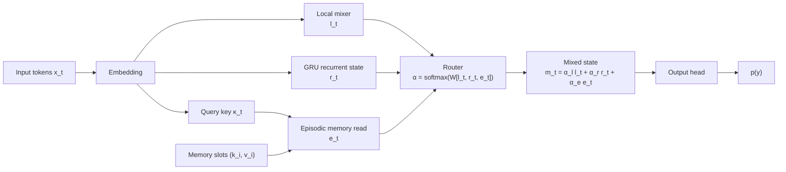
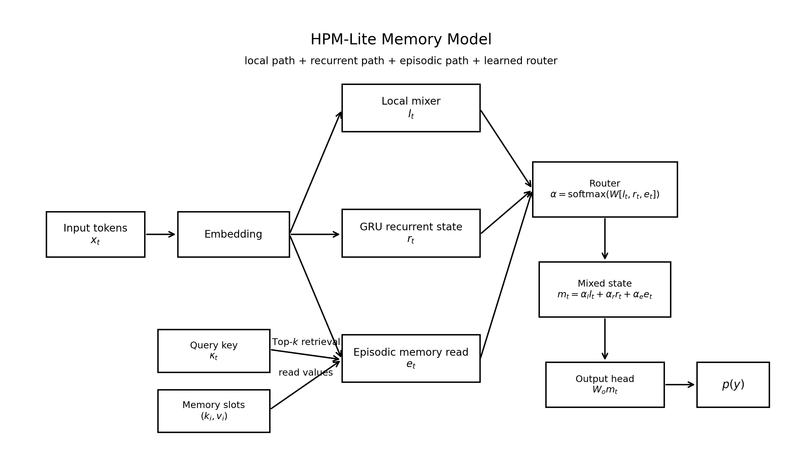

# HPM-Lite Memory Model

> **A compact PyTorch experiment testing whether a small HPM-style memory model can recall long-range key-value facts better than a same-scale local Transformer.**

HPM-Lite Memory Model is a focused research prototype for studying **long-range exact recall**. It compares a fixed-window local Transformer baseline against a small hierarchical memory model with local, recurrent, and episodic memory paths.

This repository is not a chatbot, not a production LLM, and not a claim that HPM replaces Transformers. It is a controlled experiment designed to answer a narrower question:

> When a fact appears far outside the local attention window, can explicit memory preserve and retrieve it better than local attention alone?

Current results suggest **yes** on synthetic key-value recall.

---

## Core idea

The task is intentionally simple:

```text
FACT k12 v77
FACT k03 v19
FACT k88 v41
NOISE ...
QUERY k03
ANSWER v19
```

The model must remember which value belongs to the queried key. The hard part is not language understanding. The hard part is that the relevant `FACT` can appear thousands of tokens before the `QUERY`.

A local Transformer can only attend to nearby tokens. If the fact is outside its local window, it mostly has to guess.

HPM-Lite adds an episodic memory path. It can write key-value facts into memory and retrieve them later, even when they are far outside the local attention window.

---

## Result snapshot

Current single-run results show HPM-Lite solving long-range synthetic key-value recall while the local-window baseline collapses outside its window.

| Setting | Seq len | Window | Local exact | HPM-Lite exact | Gain | Local CE | HPM CE |
|---|---:|---:|---:|---:|---:|---:|---:|
| Oracle write | 512 | 256 | 0.0063 | 1.0000 | +0.9938 | 7.37 | 0.00 |
| Oracle write | 2048 | 256 | 0.0000 | 1.0000 | +1.0000 | 7.35 | 0.00 |
| Null-slot memory | 4096 | 256 | 0.0000 | 1.0000 | +1.0000 | 13.71 | 0.00 |
| Null-slot memory | 8192 | 256 | 0.0000 | 1.0000 | +1.0000 | 23.87 | 0.00 |
| Learned writer | 512 | 256 | 0.0125 | 1.0000 | +0.9875 | 6.27 | 0.00 |
| Learned writer | 2048 | 256 | 0.0000 | 1.0000 | +1.0000 | 6.63 | ~0.00 |

The most important recent result is the **2048-token learned-writer run**:

| Metric | Value |
|---|---:|
| HPM-Lite exact accuracy | 1.0000 |
| HPM-Lite answer CE | 0.0000013 |
| Retrieval top1 | 1.0000 |
| Retrieval topk | 1.0000 |
| True fact written rate | 0.99375 |
| Missed fact rate | 0.00625 |
| False write rate | 0.00625 |
| Parameters | 721,671 |
| Train time | 5137.64 seconds |
| GPU | RTX 4060 |

This is a meaningful step beyond oracle memory: the model is no longer simply handed perfect writes at evaluation. It uses a supervised learned writer to select memory slots.

---

## Visual overview



If Mermaid rendering is unavailable, see the static architecture figure:



---

## Architecture

HPM-Lite uses three paths:

1. **Local path**  
   Handles nearby token interactions.

2. **Recurrent path**  
   Maintains a compressed sequential state.

3. **Episodic path**  
   Stores and retrieves sparse key-value facts.

The router learns how much to trust each path at each timestep.

Mathematically:

```math
l_t = \mathrm{LocalMixer}(x_{1:t})
```

```math
r_t = \mathrm{GRU}(x_t, r_{t-1})
```

```math
e_t = \sum_{i \in \mathrm{TopK}(\kappa_t)} \mathrm{softmax}(\kappa_{t,i}) \nu_i
```

```math
\alpha = \mathrm{softmax}(W[l_t, r_t, e_t])
```

```math
m_t = \alpha_l l_t + \alpha_r r_t + \alpha_e e_t
```

```math
p(y) = \mathrm{softmax}(W_o m_t)
```

---

## What “local baseline” means

The local baseline is a small Transformer-like model with a fixed local attention window.

If the local window is 256 tokens and the fact appears 2048 tokens before the query, the local model cannot directly inspect the fact.

That is why the local baseline is expected to fail at long distances. It is the control group for testing whether explicit memory helps.

---

## What answer-position CE means

Answer-position cross entropy measures how much probability the model assigns to the correct answer token:

```math
\mathrm{CE} = -\log(p(\mathrm{correct\ answer}))
```

Lower is better.

| CE | Approx. probability on correct answer | Interpretation |
|---:|---:|---|
| 0 | ~100% | confidently correct |
| 7 | ~0.09% | mostly wrong |
| 14 | ~0.00008% | extremely wrong |
| 24 | ~0.000000004% | essentially zero probability |

In the current results, HPM-Lite stays near zero CE while the local baseline becomes increasingly wrong as distance grows.

---

## Current figures

The repository includes generated figures in `docs/figures/`.

Recommended figure set:

| Figure | Purpose |
|---|---|
| `01_exact_recall_vs_distance.png` | Main accuracy result |
| `02_answer_ce_vs_distance.png` | Confidence/error comparison |
| `03_correct_answer_probability_from_ce.png` | Converts CE into intuitive probability |
| `04_ce_gap_by_distance.png` | Shows the widening CE gap |
| `05_error_rate_log_scale.png` | Shows error rate on a log scale |
| `06_parameter_count_by_run.png` | Tracks parameter count across runs |
| `07_learned_writer_progress.png` | Learned writer accuracy/recall |
| `08_learned_writer_ce_comparison.png` | Learned-writer CE comparison |
| `hpm_lite_model_paths.png` | Architecture diagram |

Example:


---

## Repository structure

```text
hpm_lite/
  data.py                 Synthetic key-value task generation
  evaluate.py             Evaluation and metric computation
  memory.py               Episodic memory read/write logic
  metrics.py              Accuracy and retrieval metrics
  model.py                Local baseline and HPM-Lite model
  train.py                Training loop
  write_modes.py          Oracle, random, and learned write modes

scripts/
  run_memory_model.py     Main experiment runner
  make_scientific_figures.py
  run_validation.py
  run_smoke.py

docs/
  scientific_results.md
  fact_check_plan.md
  figures/

results/
  oracle_distance_results.csv
  learned_writer_results.csv
  derived_statistics.csv

tests/
  test_memory.py
  test_hpm_lite_router.py
  test_shapes.py
  test_learned_writer.py
```

---

## Installation

Clone the repo:

```bash
git clone https://github.com/felixpatriciorei/HPM-Lite-Memory-Model.git
cd HPM-Lite-Memory-Model
```

Install requirements:

```bash
pip install -r requirements.txt
```

For CUDA users, verify PyTorch sees the GPU:

```bash
python -c "import torch; print(torch.__version__); print(torch.cuda.is_available()); print(torch.cuda.get_device_name(0) if torch.cuda.is_available() else 'no cuda')"
```

---

## Tests

Run all tests:

```bash
pytest -q
```

Run targeted tests:

```bash
pytest -q tests/test_memory.py tests/test_hpm_lite_router.py tests/test_shapes.py tests/test_learned_writer.py
```

---

## Running experiments

### Oracle / null-slot memory run

```bash
python scripts/run_memory_model.py \
  --seq-len 2048 \
  --window 256 \
  --d-model 192 \
  --layers 2 \
  --heads 4 \
  --steps 200 \
  --batch-size 32 \
  --device cuda \
  --memory-null-slot
```

### Learned-writer run

```bash
python scripts/run_memory_model.py \
  --seq-len 2048 \
  --window 256 \
  --d-model 128 \
  --layers 1 \
  --heads 4 \
  --steps 600 \
  --batch-size 8 \
  --device cuda \
  --memory-null-slot \
  --write-mode learned \
  --learned-writer-teacher-forcing-steps 200 \
  --lambda-writer 0.3
```

### Smaller 8GB GPU run

```bash
python scripts/run_memory_model.py \
  --seq-len 8192 \
  --window 256 \
  --d-model 96 \
  --layers 1 \
  --heads 4 \
  --steps 80 \
  --batch-size 2 \
  --device cuda \
  --memory-null-slot
```

---

## Generating figures

```bash
python scripts/make_scientific_figures.py
```

This regenerates the figures in:

```text
docs/figures/
```

---

## Result files

Current summarized result files:

```text
results/oracle_distance_results.csv
results/learned_writer_results.csv
results/derived_statistics.csv
```

Raw run summaries should be copied from `runs/` into `docs/` before committing, because `runs/` is normally ignored:

```bash
copy /Y runs\memory_model\memory_model_summary.csv docs\memory_model_summary_2048_learned_writer.csv
```

---

## Interpreting the current evidence

The current evidence supports this limited claim:

> On synthetic long-range key-value recall, HPM-Lite can preserve and retrieve facts that a same-scale local-window baseline cannot access.

The current evidence does **not** prove:

- general language understanding
- chatbot ability
- replacement of full attention
- natural-language fact extraction
- fully autonomous memory writing
- production readiness

This distinction matters. The project is currently a memory-mechanism experiment, not a general AI system.

---

## Why the learned writer matters

Earlier runs used oracle writes. That means the model was given clean memory slots.

Oracle runs are still useful because they test whether retrieval and readout work, but they do not prove the model can decide what to remember.

The learned writer is the next stage. It learns which positions should be written to memory using synthetic supervision.

Current learned-writer results:

| Seq len | Local exact | HPM exact | Writer recall | Retrieval top1 |
|---:|---:|---:|---:|---:|
| 512 | 0.0125 | 1.0000 | 0.9922 | 1.0000 |
| 2048 | 0.0000 | 1.0000 | 0.99375 | 1.0000 |

This means the model is beginning to move away from pure oracle memory, while still using controlled supervision.

---

## Current limitations

The project is still early.

Known limitations:

- mostly single-seed results
- synthetic key-value data only
- learned writer uses synthetic labels
- model sizes differ across some distance runs
- no full ablation suite yet
- no parameter-matched sweep yet
- no natural-language memory extraction yet
- no commercial inference optimization yet

---

## Next experiments

The next serious evidence should come from ablations and controls.

### Ablations

Run:

- full HPM-Lite
- no episodic memory
- no recurrent path
- no router
- no null slot
- local baseline

Expected strong pattern:

```text
full HPM-Lite works
local baseline fails
no-episodic fails
shuffled-memory fails
missing-key routes to null
```

### Controls

Run:

- shuffled memory values
- random writes
- missing-key queries
- no retrieval
- near-duplicate keys

These controls are important because they show the model succeeds for the right reason.

### Efficiency

Record:

- parameter count
- peak VRAM
- examples/sec
- tokens/sec
- wall-clock training time

This matters because the claim includes “similar compute.”

### Multi-seed runs

Run at least 3 seeds per setting and plot:

- mean
- standard deviation
- confidence interval

That is the main step from “promising demo” to “research-grade evidence.”

---

## Roadmap

1. Add `--models` so experiments can run only `local`, only `hpm_lite`, or both.
2. Add `--log-every` so long runs show progress.
3. Add VRAM and tokens/sec logging.
4. Add checkpoint/resume support.
5. Add ablation flags.
6. Add missing-key and shuffled-memory controls.
7. Run 3-seed sweeps.
8. Add natural-ish fact templates.
9. Only after exact recall is stable: add latent predictive objectives.

---

## Citation

```bibtex
@software{hpm_lite_memory_model,
  title = {HPM-Lite Memory Model},
  author = {Felix Patricio},
  year = {2026},
  url = {https://github.com/felixpatriciorei/HPM-Lite-Memory-Model}
}
```

---

## Status

This repository currently demonstrates a strong early result on controlled synthetic long-range memory recall.

It should be read as:

> promising mechanism evidence

not as:

> finished architecture proof
