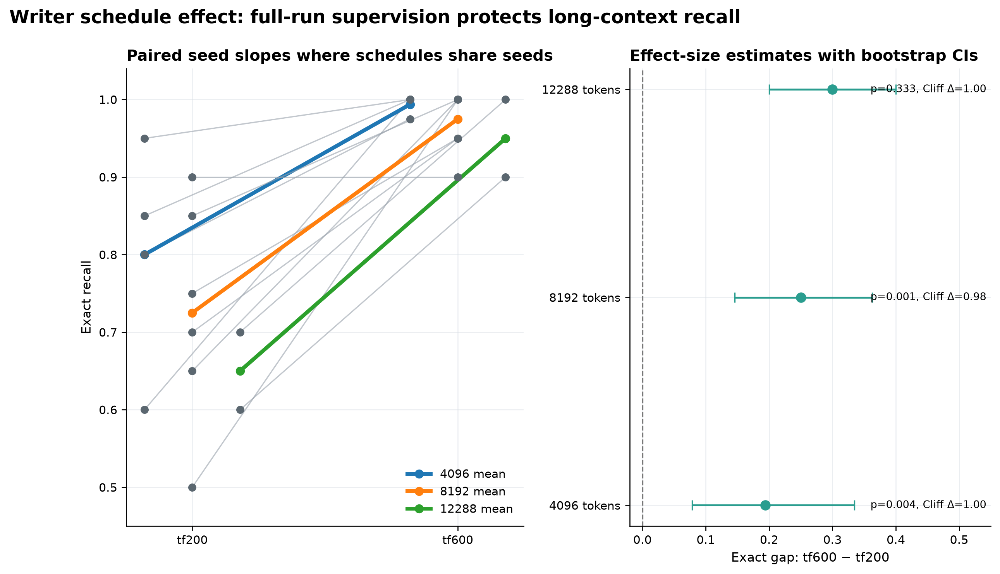
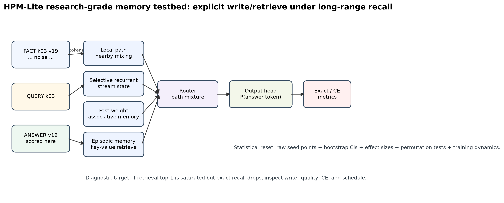
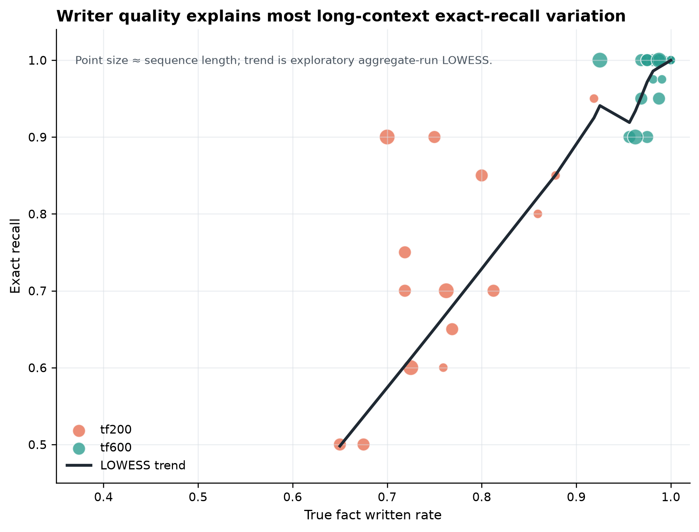

# HPM-Lite

Small PyTorch experiments for long-range **exact recall** with explicit neural memory.

HPM-Lite is a research testbed, not a language model. It asks whether a compact model can store key-value facts in memory and recover them thousands of tokens later, beyond a fixed local attention window.

<p align="center">
  
</p>

## Why this exists

Standard attention is a strong content-addressable memory while the needed tokens remain inside the context window. The hard case is different: a fact appears early, distractor tokens fill the middle, and the query arrives after the relevant fact has fallen outside the local window.

HPM-Lite isolates that problem with a synthetic key-value recall task:

```text
FACT k12 v77
FACT k03 v19
FACT k88 v41
NOISE ...
QUERY k03
ANSWER v19
```

The answer is scored only at the final answer position. The main question is not whether the model can model language; it is whether it writes the right facts, retrieves them later, and routes retrieved memory into prediction.

## Current result

On the long-context v2 stress matrix, full-run writer supervision (`tf600`) keeps exact recall high at 4096 and 8192 tokens. Early-stop writer supervision (`tf200`) drops sharply, even when retrieval top-1 stays near 1.0.

**Working interpretation:** in these runs, retrieval is mostly saturated; the remaining long-context failure mode is writer/value quality.

### Canonical Kaggle runs

These are the claim-facing Kaggle T4 runs. Intervals are percentile bootstrap 95% confidence intervals over seeds. The 12288-token rows are included as early stress evidence, not a final claim.

| Sequence length | Schedule | Seeds | Exact accuracy | 95% CI | Writer true-fact rate | Retrieval top-1 | Status |
|---:|:---|---:|---:|:---|---:|---:|:---|
| 4096 | tf600 | 8 | 0.9938 | [0.9844, 1.0000] | 0.9914 | 1.0000 | stable |
| 4096 | tf200 | 4 | 0.8000 | [0.6625, 0.9125] | 0.8539 | 1.0000 | comparison |
| 8192 | tf600 | 8 | 0.9750 | [0.9500, 0.9938] | 0.9766 | 1.0000 | stable |
| 8192 | tf200 | 6 | 0.7250 | [0.6167, 0.8250] | 0.7344 | 0.9907 | comparison |
| 12288 | tf600 | 2 | 0.9500 | [0.9000, 1.0000] | 0.9437 | 1.0000 | low-n |
| 12288 | tf200 | 2 | 0.6500 | [0.6000, 0.7000] | 0.7437 | 1.0000 | low-n |

Schedule effect, measured as `tf600 - tf200` exact accuracy:

| Sequence length | Exact gap | 95% CI | Permutation p | Cliff's delta | Status |
|---:|---:|:---|---:|---:|:---|
| 4096 | +0.1938 | [0.0781, 0.3344] | 0.0040 | 1.0000 | claim-facing |
| 8192 | +0.2500 | [0.1458, 0.3625] | 0.0013 | 0.9792 | claim-facing |
| 12288 | +0.3000 | [0.2000, 0.4000] | 0.3333 | 1.0000 | low-n |

<p align="center">
  
</p>

## Model sketch

HPM-Lite uses a small hybrid memory stack:

```text
input tokens
   │
   ├─ local path: recent exact token mixing
   ├─ recurrent path: compressed stream state
   ├─ fast-weight path: associative update/read memory
   └─ episodic path: sparse fact retrieval
        ↓
      router
        ↓
   answer distribution
```

The v1 path is a smaller learned write/retrieve memory model. The v2 path adds local mixing, selective recurrent state, fast-weight associative memory, episodic retrieval, and a four-path router. The implementation is deliberately small so that the behavior can be audited seed by seed.

<p align="center">
  
</p>

## What is measured

The project tracks memory-native diagnostics, not just final accuracy:

- answer exact accuracy
- answer cross-entropy
- retrieval top-1 / top-k
- true fact written rate
- false write rate
- missed fact rate
- written slots per sample
- retrieval margin
- parameter count
- peak VRAM
- wall time
- examples/sec
- step-level training logs

<p align="center">
  
</p>

## Research-grade figures

The current figure system is generated by one script:

```bash
python scripts/reset_research_grade_figures.py
```

It writes:

```text
results/figures/research_grade/
results/processed/research_grade/
```

The figure set includes:

| Figure | Purpose |
|---|---|
| `fig_rg_02_exact_claim_forest` | claim-facing exact recall with bootstrap intervals |
| `fig_rg_03_writer_schedule_estimation` | effect-size view of `tf600 - tf200` |
| `fig_rg_04_writer_quality_vs_exact` | relationship between writer quality and answer accuracy |
| `fig_rg_05_retrieval_saturated_failure` | failures when retrieval is already near-perfect |
| `fig_rg_06_training_dynamics_lowess` | raw step logs with LOWESS smoothing |
| `fig_rg_07_seed_distribution_ecdf` | distribution view without binning |
| `fig_rg_08_cost_performance_pareto` | accuracy versus VRAM and wall time |
| `fig_rg_09_metric_heatmap` | compact metric summary |
| `fig_rg_10_exploratory_pairgrid` | exploratory pairwise diagnostics |

An interactive Plotly dashboard is also generated:

```text
results/figures/research_grade/interactive/hpm_v2_long_context_parallel_coordinates.html
```

<p align="center">
  
</p>

## Quick start

```bash
git clone https://github.com/felixpatriciorei/HPM-Lite-Memory-Model.git
cd HPM-Lite-Memory-Model
python -m pip install -r requirements.txt
python -m pytest -q
```

Regenerate the current result tables and figures:

```bash
python scripts/reset_research_grade_figures.py
```

Run a small v2 smoke/stress run:

```bash
python -u scripts/run_memory_model.py \
  --models hpm_lite_v2 \
  --seq-len 512 \
  --window 256 \
  --d-model 128 \
  --layers 1 \
  --heads 4 \
  --steps 600 \
  --batch-size 16 \
  --device cuda \
  --memory-null-slot \
  --write-mode learned \
  --learned-writer-teacher-forcing-steps 200 \
  --lambda-writer 0.3 \
  --log-every 50 \
  --save-step-log \
  --record-vram \
  --save-checkpoint false \
  --summary-csv results/raw/hpm_v2_512_seed0.csv \
  --seed 0
```

## Repository layout

```text
hpm_lite/                         model, memory, training, and evaluation code
scripts/run_memory_model.py        main experiment runner
scripts/reset_research_grade_figures.py
scripts/make_research_grade_figures.py
                                  current statistics and figure pipeline
results/raw/                       imported seed-level run summaries
results/processed/research_grade/  canonical processed tables
results/figures/research_grade/    current figure set
docs/research_grade_statistics_methods.md
docs/research_grade_results.md
tests/                             unit and integration tests
```

## Main files

```text
hpm_lite/hpm_v2.py
hpm_lite/hpm_v2_model.py
hpm_lite/train.py
hpm_lite/evaluate.py
hpm_lite/memory.py
scripts/run_memory_model.py
scripts/make_research_grade_figures.py
results/processed/research_grade/hpm_v2_research_grade_run_matrix.csv
results/processed/research_grade/hpm_v2_research_grade_inference_summary.csv
results/processed/research_grade/hpm_v2_research_grade_schedule_effects.csv
```

## Scope and limitations

HPM-Lite is a controlled memory experiment. It does not claim to be a general LLM, to beat modern long-context models, or to prove that synthetic key-value recall transfers directly to real language tasks.

Current limitations:

- 12288-token evidence is promising but under-sampled.
- The project still needs local-baseline stress runs at 4096/8192/12288.
- v2 path ablations are planned but not complete.
- Mixed Kaggle/PC runs are useful sensitivity checks, not the primary claim set.
- Per-example failure logs would make the writer/retrieval diagnosis stronger.

## Roadmap

Near-term:

- add more 12288-token seeds
- run long-context local baselines
- add v2 ablations: no episodic path, no fast-weight path, no selective recurrent path, router disabled
- add per-example failure traces
- separate paper-ready figures from exploratory dashboards

Longer-term:

- natural-language key-value recall
- planted-fact document QA
- multi-hop/entity-state tracking
- memory adapter experiments for small frozen LLMs

## Citation status

No formal paper release yet. Cite the repository directly if you use the code or figures.

## License

No license has been declared yet. Treat the repository as source-available unless a license is added.
