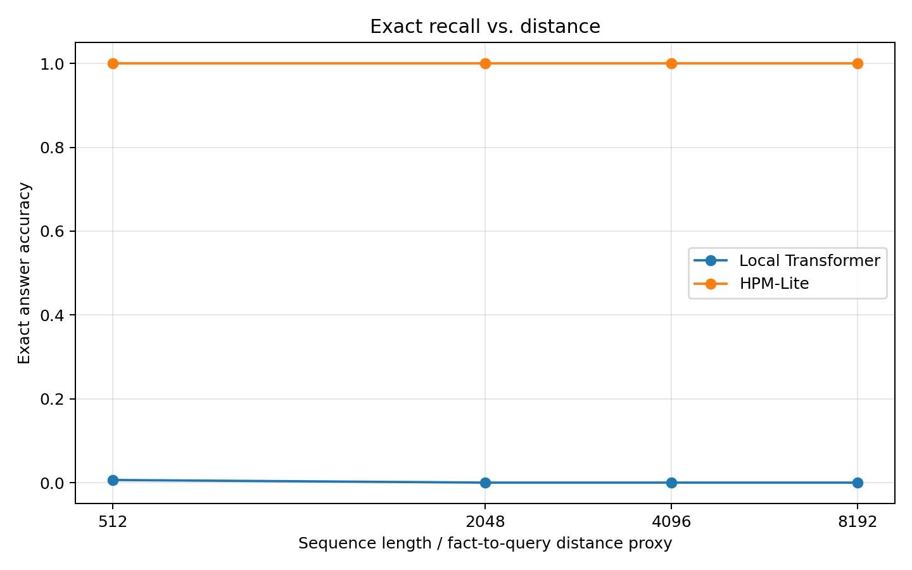

# HPM-Lite Memory Model

> A compact PyTorch research prototype for testing one narrow claim:  
> **Can a small HPM-style model remember long-range key-value facts better than a same-size local Transformer under similar compute?**

This repository is not a chatbot, not a production LLM, and not a claim that HPM replaces Transformers. It is a controlled memory experiment: a local-attention baseline is compared against a small HPM-Lite model with local, recurrent, and episodic memory paths.

The goal is to build a reproducible proof object: code, commands, metrics, graphs, and failure cases.

---

## Current result snapshot

Early single-seed runs show HPM-Lite recovering long-range key-value facts that the local-window baseline fails to recover.



| Seq len | Window | Local exact | HPM-Lite exact | Gain | Local params | HPM params |
|---:|---:|---:|---:|---:|---:|---:|
| 512 | 256 | 0.0063 | 1.0000 | +0.9938 | 1.38M | 1.78M |
| 2048 | 256 | 0.0000 | 1.0000 | +1.0000 | 1.38M | 1.78M |
| 4096 | 256 | 0.0000 | 1.0000 | +1.0000 | 0.78M | 0.97M |
| 8192 | 256 | 0.0000 | 1.0000 | +1.0000 | 0.94M | 1.05M |

**Interpretation:** these results support the narrow claim that explicit episodic memory can preserve exact long-range facts outside the local attention window. They do **not** yet prove general language understanding, autonomous memory writing, or replacement of full attention.

See [`docs/memory_model_results.md`](docs/memory_model_results.md) for the full table and caveats.

---

## The experiment

The task is synthetic key-value recall. A sequence contains facts, distractors, a query, and an answer target:

```text
FACT k12 v77
FACT k03 v19
FACT k88 v41
NOISE ...
QUERY k03
ANSWER v19
```

The model must output the correct value at the answer position.

The important variable is distance: facts are placed far before the query. The local baseline only has a fixed local window, so if the needed fact is outside that window, it should struggle unless it finds a shortcut. HPM-Lite gets an explicit episodic memory path.

---

## Models

### Model A: local Transformer baseline

A tiny local-window Transformer. It has no global attention and no external memory.

```text
tokens -> embedding -> local Transformer blocks -> answer logits
```

### Model B: HPM-Lite

HPM-Lite uses three memory paths:

```text
x_t -> embedding

l_t = local mixer
r_t = GRU recurrent state
e_t = episodic memory retrieval

alpha = softmax(W[l_t, r_t, e_t])

m_t = alpha_l l_t + alpha_r r_t + alpha_e e_t
p(y) = softmax(W_o m_t)
```

The current version intentionally avoids large-model distractions:

- no JEPA objective yet
- no ANN index yet
- no full global attention
- no chatbot tuning
- no large-scale language modeling

The first version uses oracle fact writes to isolate the retrieval/readout problem. Learned writing is a later stage.

---

## Why this is useful

Full attention is strong because it is a content-addressable memory over the visible context. But full global attention becomes expensive as context grows. HPM-Lite tests a smaller question:

> If a local model cannot see an old fact anymore, can a sparse episodic memory path recover it reliably?

This repository is designed to answer that question with controlled experiments rather than slogans.

---

## Repository structure

```text
hpm_lite/
  data.py                 Synthetic key-value and diagnostic tasks
  model.py                Local Transformer and HPM-Lite model code
  memory.py               Episodic memory utilities
  train.py                Training loop
  evaluate.py             Evaluation helpers
  metrics.py              Exact accuracy and retrieval metrics
  write_modes.py          Oracle/random/parser write controls

scripts/
  run_memory_model.py     Main local-vs-HPM experiment
  run_validation.py       Retrieval and write-mode controls
  run_smoke.py            Fast sanity checks
  plot_results.py         Generate result figures

docs/
  memory_model_results.md Current result table and interpretation
  fact_check_plan.md      Reproducibility and audit checklist
  figures/                Generated graphs

results/
  memory_model_results_current.csv
```

---

## Install

```bash
git clone https://github.com/felixpatriciorei/HPM-Lite-Memory-Model.git
cd HPM-Lite-Memory-Model
pip install -r requirements.txt
```

For CUDA, use a PyTorch build that actually supports your GPU. Verify with:

```bash
python -c "import torch; print(torch.__version__); print(torch.cuda.is_available()); print(torch.cuda.get_device_name(0) if torch.cuda.is_available() else 'no cuda')"
```

---

## Quick tests

```bash
pytest -q
```

For a smaller targeted test:

```bash
pytest -q tests/test_memory.py tests/test_hpm_lite_router.py tests/test_shapes.py
```

---

## Run the core experiment

CPU smoke run:

```bash
python scripts/run_memory_model.py   --seq-len 512   --window 256   --d-model 96   --layers 1   --heads 4   --steps 20   --batch-size 4   --device cpu
```

CUDA run:

```bash
python scripts/run_memory_model.py   --seq-len 2048   --window 256   --d-model 192   --layers 2   --heads 4   --steps 200   --batch-size 32   --device cuda
```

Longer runs for 8GB GPUs should use smaller batches and smaller models:

```bash
python scripts/run_memory_model.py   --seq-len 4096   --window 256   --d-model 128   --layers 1   --heads 4   --steps 150   --batch-size 4   --device cuda   --memory-null-slot
```

```bash
python scripts/run_memory_model.py   --seq-len 8192   --window 256   --d-model 96   --layers 1   --heads 4   --steps 80   --batch-size 2   --device cuda   --memory-null-slot
```

---

## Plot results

```bash
python scripts/plot_results.py   --input results/memory_model_results_current.csv   --out-dir docs/figures
```

This regenerates:

- `docs/figures/exact_recall_vs_distance.png`
- `docs/figures/exact_gain_by_distance.png`
- `docs/figures/answer_ce_vs_distance.png`

---

## Current limitations

This repo is deliberately honest about what is and is not proven.

Already shown:

- HPM-Lite can solve synthetic long-range key-value recall when facts are written into episodic memory.
- The local-window baseline collapses when the needed fact is outside its window.
- Retrieval top-1 can reach 1.0 on the current oracle-write task.

Not yet proven:

- multiple-seed robustness
- parameter-matched comparisons across every distance
- learned writing without oracle fact labels
- robustness to missing keys and irrelevant memory
- real natural-language extraction
- chatbot behavior
- replacement of full attention in general language modeling

---

## Next proof milestones

1. **Multi-seed distance sweep**  
   Run 512, 2048, 4096, 8192, and 16384 across seeds 0, 1, and 2.

2. **Ablations**  
   Compare:
   - full HPM-Lite
   - no episodic memory
   - no recurrent path
   - no router
   - local baseline

3. **Null-slot and no-match controls**  
   Test queries with no valid key. The model should be able to route to a null memory instead of confidently retrieving garbage.

4. **Parameter matching**  
   Keep local and HPM-Lite parameter counts within a small range, then rerun the main table.

5. **Learned writer**  
   Replace oracle fact writes with learned write decisions, slowly.

6. **Harder synthetic tasks**  
   Add near-duplicate keys, collisions, multi-hop retrieval, and distractor-heavy sequences.

---

## Fact-checking checklist

Before treating a result as evidence, verify:

- the command is recorded
- the commit hash is recorded
- CUDA/CPU environment is recorded
- the same script can reproduce the result from a clean clone
- local and HPM-Lite use comparable parameter counts
- no answer leakage is present in the local window
- no-retrieval and shuffled-value controls fail as expected
- HPM-Lite collapses when episodic memory is removed
- results are averaged across multiple seeds
- failed/OOM runs are documented instead of hidden

See [`docs/fact_check_plan.md`](docs/fact_check_plan.md).

---

## Design notes

HPM-Lite is based on a memory hierarchy idea:

- local attention handles exact recent lookup
- recurrent memory handles cheap continuity
- episodic memory preserves rare exact facts
- a router decides how much to use each path

This repo currently implements the local, recurrent, and episodic parts. Latent predictive/JEPA-style objectives are intentionally postponed until exact recall is stable.

---

## License

Add a license before encouraging external contributions. MIT is simple for open research code, but choose intentionally.

---

## Citation

No formal paper release yet. For now, cite the repository:

```bibtex
@software{hpm_lite_memory_model,
  title = {HPM-Lite Memory Model},
  author = {Felix Patricio},
  year = {2026},
  url = {https://github.com/felixpatriciorei/HPM-Lite-Memory-Model}
}
```

---

## Status

Research prototype. The current result is promising, but the project is still in the evidence-building phase.
