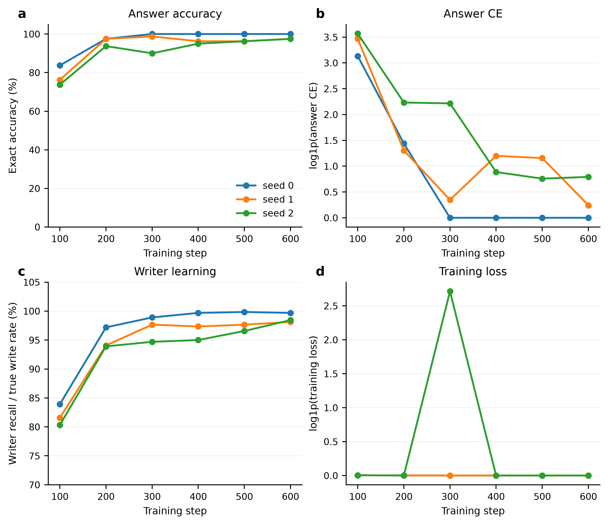
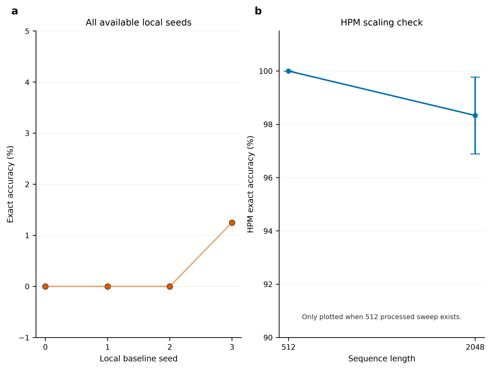

# HPM-Lite Memory Model

> A small PyTorch research artifact for testing whether explicit episodic memory helps with long-range exact recall when a fixed-window Transformer cannot see the original fact.

This repository is **not** a chatbot, production LLM, or finished architecture proof. It is a controlled experiment around one question:

> Can a small HPM-style model learn to write key-value facts into memory, retrieve them thousands of tokens later, and outperform a similarly local Transformer baseline on exact recall?

Current answer: **yes on the synthetic KV benchmark tested here**. At 2048 tokens with a 256-token local window, HPM-Lite with a learned writer reaches **98.33% mean exact answer accuracy over 3 seeds**, while the matched local Transformer baseline reaches **0.00% over 3 matched seeds**.

<p align="center">
  
</p>

<p align="center"><sub>Main 2048-token comparison. Generated from processed CSVs by <code>scripts/make_research_figures.py</code>.</sub></p>

---

## Start here

| What you want | Where to look |
|---|---|
| Main result | [`results/figures/paper/fig_02_main_2048_results.png`](results/figures/paper/fig_02_main_2048_results.png) |
| Model/task schematic | [`results/figures/paper/fig_01_model_task_schematic.png`](results/figures/paper/fig_01_model_task_schematic.png) |
| Writer/retrieval diagnostics | [`results/figures/paper/fig_03_writer_retrieval_diagnostics.png`](results/figures/paper/fig_03_writer_retrieval_diagnostics.png) |
| Training curves | [`results/figures/paper/fig_04_hpm_training_dynamics.png`](results/figures/paper/fig_04_hpm_training_dynamics.png) |
| Processed 2048 HPM data | [`results/processed/learned_writer_2048_seed_sweep.csv`](results/processed/learned_writer_2048_seed_sweep.csv) |
| Processed 2048 local baseline data | [`results/processed/local_2048_seed_sweep.csv`](results/processed/local_2048_seed_sweep.csv) |
| Figure audit report | [`results/figures/paper/figure_audit_report.md`](results/figures/paper/figure_audit_report.md) |
| Figure generation script | [`scripts/make_research_figures.py`](scripts/make_research_figures.py) |

If the images above do not render on GitHub, run the figure-generation command below and commit `results/figures/paper/`.

---

## The task

The benchmark is intentionally simple. A sequence contains facts, noise, a query, then an answer position:

```text
FACT k12 v77
FACT k03 v19
FACT k88 v41
NOISE ...
QUERY k03
ANSWER v19
```

The model is scored only at the answer position. The important difficulty is distance: the relevant fact can appear far outside the local attention window.

Main setting:

```text
sequence length = 2048
local window    = 256
```

A fixed-window local Transformer cannot directly attend back to many earlier facts at answer time. HPM-Lite is given an explicit episodic memory mechanism and must learn when to write and retrieve.

---

## Model idea

HPM-Lite combines three paths:

1. **Local path** for nearby token mixing.
2. **Recurrent path** for compressed stream state.
3. **Episodic path** for sparse key-value memory retrieval.

A learned router mixes the paths before prediction:

```math
l_t = \mathrm{LocalMixer}(x_{1:t})
```

```math
r_t = \mathrm{GRU}(x_t, r_{t-1})
```

```math
e_t = \mathrm{EpisodicRead}(\kappa_t, M)
```

```math
\alpha = \mathrm{softmax}(W[l_t, r_t, e_t])
```

```math
m_t = \alpha_l l_t + \alpha_r r_t + \alpha_e e_t
```

```math
p(y_t) = \mathrm{softmax}(W_o m_t)
```

<p align="center">
  
</p>

<p align="center"><sub>Architecture and task schematic. This figure is meant to explain the mechanism, not to claim biological or production-scale plausibility.</sub></p>

---

## Main result: 2048-token learned writer

The headline result uses processed seed-sweep CSVs, not a single cherry-picked run.

| Model | Seq len | Window | Seeds | Params | Exact accuracy | Answer CE |
|---|---:|---:|---:|---:|---:|---:|
| HPM-Lite, learned writer | 2048 | 256 | 3 | 721,671 | **0.9833 ± 0.0144** | **0.4943 ± 0.6340** |
| Local Transformer baseline | 2048 | 256 | 3 matched | 522,242 | **0.0000 ± 0.0000** | **6.8873 ± 0.3920** |
| Local Transformer baseline | 2048 | 256 | 4 total | 522,242 | 0.0031 ± 0.0063 | 6.9785 ± 0.3684 |

Error bars are **sample standard deviation across seeds**, not confidence intervals.

### Seed-level results

| Seed | HPM exact | HPM CE | HPM retrieval top1 | True fact written | Missed fact | False write |
|---:|---:|---:|---:|---:|---:|---:|
| 0 | 1.0000 | 0.0000 | 1.0000 | 0.9969 | 0.0031 | 0.0031 |
| 1 | 0.9750 | 0.2737 | 1.0000 | 0.9813 | 0.0188 | 0.0188 |
| 2 | 0.9750 | 1.2091 | 1.0000 | 0.9844 | 0.0156 | 0.0156 |

| Seed | Local exact | Local CE |
|---:|---:|---:|
| 0 | 0.0000 | 6.5883 |
| 1 | 0.0000 | 6.7425 |
| 2 | 0.0000 | 7.3310 |
| 3, extra | 0.0125 | 7.2522 |

The useful interpretation is not “HPM is magically perfect.” It is:

> The learned memory route makes the task mostly solvable at 2048 tokens, while the fixed-window baseline remains near failure. The HPM misses that remain are mostly associated with learned write misses, because retrieval top-1 is 100% across the HPM seeds once the fact is written.

---

## Diagnostics

<p align="center">
  
</p>

<p align="center"><sub>Writer and retrieval diagnostics. Local-model writer columns are ignored because they are bookkeeping artifacts, not local-memory behavior.</sub></p>

The diagnostic story:

- HPM retrieval top-1 is `1.0` across the 2048 learned-writer seeds.
- Exact accuracy is slightly below 100% in seeds 1 and 2.
- The miss pattern lines up with learned write misses, not retrieval collapse.
- The local baseline should be judged by exact accuracy, CE, parameters, VRAM, speed, and wall time — not writer metrics.

---

## Training dynamics

<p align="center">
  
</p>

<p align="center"><sub>HPM-Lite training curves from step logs. These show how exact accuracy, answer CE, writer recall, and loss evolve during training.</sub></p>

The learning curves matter because the final table alone hides instability. For example, one 2048 seed has a visible loss spike during training but recovers by step 600. That is worth showing rather than hiding.

---

## Supplemental checks

<p align="center">
  
</p>

<p align="center"><sub>Supplemental checks: extra local seed and optional 512-to-2048 comparison when the 512 processed sweep exists.</sub></p>

This figure is not the main claim. It exists to make the result easier to audit.

---

## What the result supports

This repo supports this limited claim:

> On a controlled synthetic long-range key-value recall benchmark, explicit episodic memory lets a small HPM-style model retain and retrieve facts that a fixed-window local Transformer baseline fails to recover at 2048 tokens.

It does **not** prove:

- general language understanding,
- chatbot ability,
- production readiness,
- superiority to all Transformer variants,
- natural-language fact extraction,
- unsupervised memory writing,
- full parameter-matched dominance.

The result is strong for the benchmark, but the benchmark is synthetic and intentionally narrow.

---

## Known caveats

- **Not parameter-matched yet.** HPM-Lite has more parameters than the local baseline in the current 2048 sweep.
- **Synthetic task.** The data is controlled key-value recall, not real natural language.
- **Learned writer supervision.** The writer is learned, but the training setup still uses synthetic supervision.
- **Local writer columns are noise.** For `model=local`, writer-related columns are bookkeeping artifacts and should not be interpreted.
- **Small sample size.** Main HPM comparison uses 3 seeds. This is enough for a serious prototype, not enough for a final broad claim.
- **Hardware is mixed.** HPM sweeps were run locally; local baselines used Kaggle T4s. This is fine for accuracy/CE, but speed comparisons should be treated carefully.

---

## Repository structure

```text
hpm_lite/
  data.py                 synthetic key-value task generation
  evaluate.py             evaluation and metric computation
  memory.py               episodic memory logic
  metrics.py              accuracy / retrieval metrics
  model.py                local baseline and HPM-Lite model
  train.py                training loop and logging
  write_modes.py          oracle, random, and learned write modes

scripts/
  run_memory_model.py     main experiment runner
  make_research_figures.py
  make_paper_figures.py
  check_readme_assets.py  verifies README image/file references

docs/
  figure_design_audit.md
  figure_reference_notes.md
  readme_design_notes.md
  repo_front_page_audit.md
  experiment_matrix.md
  logging_schema.md

results/
  processed/              committed processed CSV sweeps
  figures/paper/          generated paper-style figures and audit report

tests/
  test_memory.py
  test_learned_writer.py
  test_hpm_lite_router.py
  test_shapes.py
  test_experiment_logging.py
```

---

## Install

```bash
git clone https://github.com/felixpatriciorei/HPM-Lite-Memory-Model.git
cd HPM-Lite-Memory-Model
python -m pip install -r requirements.txt
```

Check CUDA:

```bash
python -c "import torch; print(torch.__version__); print(torch.cuda.is_available()); print(torch.cuda.get_device_name(0) if torch.cuda.is_available() else 'no cuda')"
```

Run tests:

```bash
python -m pytest -q
```

---

## Reproduce one 2048 HPM seed

```bash
python -u scripts/run_memory_model.py \
  --models hpm_lite \
  --seq-len 2048 \
  --window 256 \
  --d-model 128 \
  --layers 1 \
  --heads 4 \
  --steps 600 \
  --batch-size 8 \
  --device cuda \
  --memory-null-slot \
  --write-mode learned \
  --learned-writer-teacher-forcing-steps 200 \
  --lambda-writer 0.3 \
  --log-every 100 \
  --save-step-log \
  --record-vram \
  --seed 0
```

## Reproduce one 2048 local baseline seed

```bash
python -u scripts/run_memory_model.py \
  --models local \
  --seq-len 2048 \
  --window 256 \
  --d-model 128 \
  --layers 1 \
  --heads 4 \
  --steps 600 \
  --batch-size 8 \
  --device cuda \
  --log-every 100 \
  --save-step-log \
  --record-vram \
  --seed 0
```

---

## Generate the paper-style figures

```bash
python scripts/make_research_figures.py
```

Expected outputs:

```text
results/figures/paper/
  fig_01_model_task_schematic.png
  fig_01_model_task_schematic.pdf
  fig_01_model_task_schematic.svg
  fig_02_main_2048_results.png
  fig_02_main_2048_results.pdf
  fig_02_main_2048_results.svg
  fig_03_writer_retrieval_diagnostics.png
  fig_04_hpm_training_dynamics.png
  fig_05_supplemental_seed_checks.png
  paper_results_table.csv
  figure_manifest.csv
  figure_audit_report.md
```

Then verify the README has no broken local image/file references:

```bash
python scripts/check_readme_assets.py
```

If this check fails, do not commit the README yet. Generate the figures or fix the paths first.

---

## Data files to trust first

Use processed CSVs before raw run folders:

```text
results/processed/learned_writer_2048_seed_sweep.csv
results/processed/local_2048_seed_sweep.csv
results/processed/learned_writer_512_seed_sweep.csv
```

Known logging caveats:

- Some raw summaries may have blank seed/model-shape fields; the processed sweep files fix the seed assignment.
- For `model=local`, writer-related columns are bookkeeping artifacts and should not be interpreted as local-memory behavior.
- The 2048 HPM-vs-local comparison is strong, but not perfectly parameter-matched.

---

## Roadmap

High-priority next experiments:

- parameter-matched local baseline,
- no-episodic-memory ablation,
- no-recurrent-path ablation,
- fixed-router or no-router ablation,
- shuffled-memory control,
- missing-key/null-slot control,
- 4096-token learned-writer sweep,
- natural-ish fact templates after synthetic KV is stable.

The rule for this repo is simple: if a figure or table makes a claim, there should be a command and a processed CSV behind it.

---

## Citation

```bibtex
@software{hpm_lite_memory_model,
  title = {HPM-Lite Memory Model},
  author = {Felix Patricio},
  year = {2026},
  url = {https://github.com/felixpatriciorei/HPM-Lite-Memory-Model}
}
```

---

## Status

Active research prototype. Promising mechanism evidence; not a finished architecture proof.
